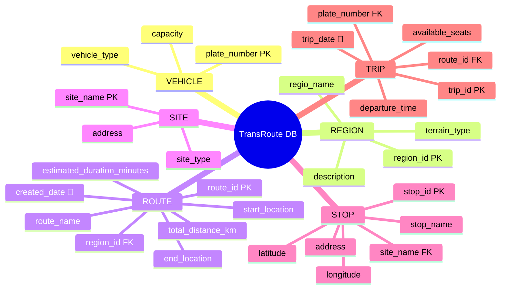
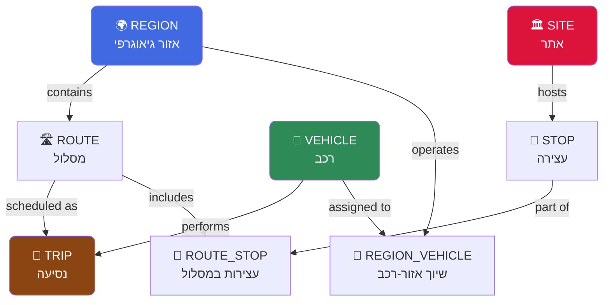
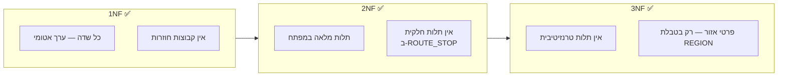
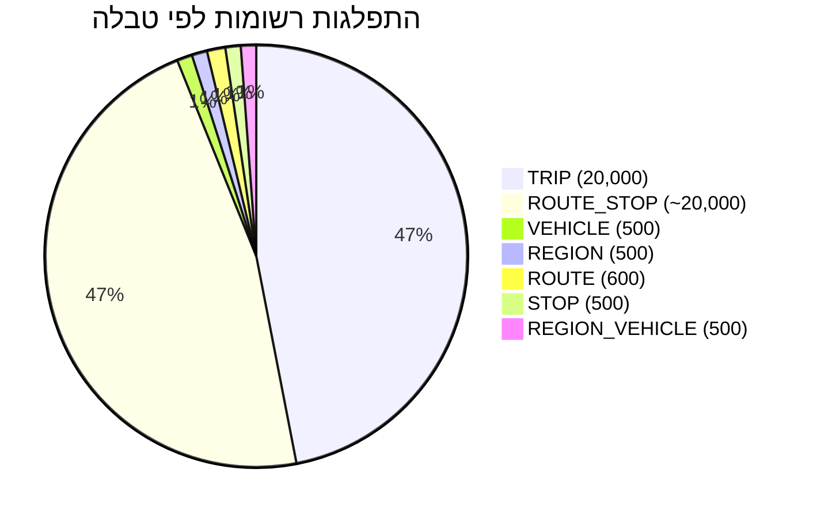
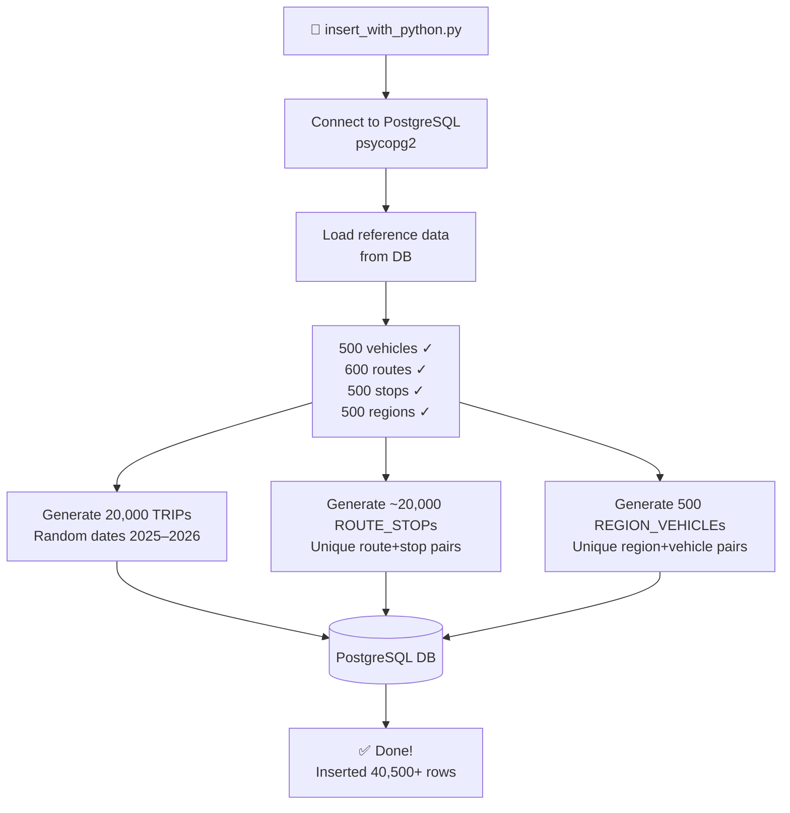

<div dir="rtl">

# 🚌 TransRoute Planner — מערכת ניהול תחבורה ציבורית

</div>

<div align="center">

**פרויקט בסיס נתונים | Database Project — שלב א׳**

[](https://www.postgresql.org/)
[](https://www.docker.com/)
[](https://www.python.org/)
[](https://www.pgadmin.org/)

</div>

---

## 📋 תוכן עניינים

| # | נושא |
|---|------|
| 1 | [🎓 שער הפרויקט](#-שער-הפרויקט) |
| 2 | [📝 מבוא — תיאור המערכת](#-מבוא--תיאור-המערכת) |
| 3 | [🖥️ מסכי המערכת — AI Studio](#️-מסכי-המערכת--ai-studio) |
| 4 | [📊 תרשים ERD](#-תרשים-erd) |
| 5 | [🗄️ תרשים DSD — סכמת הנתונים](#️-תרשים-dsd--סכמת-הנתונים) |
| 6 | [📚 מילון הנתונים](#-מילון-הנתונים) |
| 7 | [💡 החלטות עיצוב ונימוקים](#-החלטות-עיצוב-ונימוקים) |
| 8 | [💾 שיטות הכנסת נתונים](#-שיטות-הכנסת-נתונים) |
| 9 | [🔒 גיבוי ושחזור](#-גיבוי-ושחזור) |
| 10 | [🗂️ מבנה הפרויקט](#️-מבנה-הפרויקט) |

---

## 🎓 שער הפרויקט

<div dir="rtl">

| פרט | מידע |
|-----|------|
| **שמות המגישים** | _[שם מגיש 1] · [שם מגיש 2]_ |
| **תעודות זהות** | _[ת"ז 1] · [ת"ז 2]_ |
| **שם המערכת** | **TransRoute Planner** — מערכת ניהול תחבורה ציבורית |
| **היחידה הנבחרת** | ניהול נסיעות, מסלולים ועצירות |
| **שנת לימודים** | 2025–2026 |
| **תאריך הגשה** | אפריל 2026 |

</div>

---

## 📝 מבוא — תיאור המערכת

### מהי המערכת?

**TransRoute Planner** היא מערכת לניהול רשת תחבורה ציבורית. המערכת מאפשרת לחברת תחבורה לנהל את כלל הנכסים התפעוליים שלה: כלי רכב, מסלולים, עצירות, אתרים, נסיעות יומיות ואזורי פעילות.

### נתונים הנשמרים במערכת

```
🚌 כלי רכב     →  לוחיות רישוי, סוג רכב, קיבולת מושבים
🌍 אזורים      →  אזורי פעילות גיאוגרפיים, סוג שטח
🛣️ מסלולים     →  נקודות מוצא ויעד, מרחק, משך נסיעה, תאריך פתיחה
🏛️ אתרים       →  מוקדים (תחנות מרכזיות, מרכזי קניות, פארקים)
🚏 עצירות      →  נקודות עצירה עם קואורדינטות GPS מדויקות
🎫 נסיעות      →  לוח זמנים יומי, שעות יציאה, מושבים פנויים
🔗 מסלול-עצירה →  סדר עצירות ושעות משוערות לאורך כל מסלול
📍 אזור-רכב    →  שיוך כלי רכב לאזורי פעילות
```

### פונקציונאליות עיקרית

<div dir="rtl">

| פעולה | תיאור |
|-------|-------|
| **ניהול מסלולים** | הגדרת מסלולים חדשים, עריכה ומחיקה |
| **תזמון נסיעות** | יצירת נסיעות עם שיוך רכב ונהג |
| **מפת נסיעות** | ויזואליזציה בזמן אמת של כל הנסיעות הפעילות |
| **ניהול עצירות** | ספריית עצירות עם מיקום GPS |
| **שיוך צי** | הקצאת כלי רכב לאזורים ומסלולים |
| **סטטיסטיקות** | ניצולת מושבים, ביצועי מסלולים |

</div>

---

## 🖥️ מסכי המערכת — AI Studio

> 🔗 **האפליקציה נוצרה בעזרת [Google AI Studio](https://aistudio.google.com)** — _(עדכן לינק לפרויקט שלך)_

המערכת מורכבת מ-4 מסכים מרכזיים:

---

### מסך 1 — Route Dashboard | לוח בקרה ראשי

> מציג את כלל המסלולים הפעילים ברשת, עם אפשרות לצפות בפרטים, לתזמן נסיעות וליצור מסלולים חדשים.


---

### מסך 2 — Trips Network Map | מפת הנסיעות הפעילות

> תצוגת מפה אינטראקטיבית של כל הנסיעות המתוזמנות בזמן אמת, כולל לגנדה של נסיעות Scheduled / In-Progress.


---

### מסך 3 — Schedule New Trip | תזמון נסיעה חדשה

> ממשק להזנת נסיעה חדשה: בחירת מסלול, תאריך, שעת יציאה, מספר נוסעים ושיוך יחידת צי (רכב + נהג). כולל תצוגת סיכום נסיעה בצד ימין.


---

### מסך 4 — Route Details & Stops | פרטי מסלול וניהול עצירות

> מסך פרטי מסלול הכולל: קטעי מסלול, ניהול עצירות (הוספה, עריכה, מחיקה, שינוי סדר), תצוגת מפה ואפשרות AI Optimization.


---

## 📊 תרשים ERD

> תרשים ה-ERD (Entity Relationship Diagram) מציג את **הישויות**, **המאפיינים** והקשרים ביניהן לפני הנורמליזציה לסכמה רלציונית.


### ישויות המערכת (6+ ישויות)



---

## 🗄️ תרשים DSD — סכמת הנתונים

> תרשים ה-DSD (Data Structure Diagram) מציג את הטבלאות הסופיות עם כל השדות, המפתחות הראשיים, המפתחות הזרים והקשרים.


### סכמה ויזואלית — Mermaid ER

```mermaid
erDiagram
    VEHICLE {
        varchar(15)  plate_number  PK
        varchar(50)  vehicle_type
        int          capacity
    }

    REGION {
        int          region_id     PK
        varchar(50)  regio_name
        varchar(50)  terrain_type
        varchar(255) description
    }

    ROUTE {
        int          route_id                    PK
        varchar(100) route_name
        varchar(100) start_location
        varchar(100) end_location
        int          estimated_duration_minutes
        float        total_distance_km
        date         created_date
        int          region_id                   FK
    }

    SITE {
        varchar(100) site_name  PK
        varchar(50)  site_type
        varchar(255) address
    }

    STOP {
        int          stop_id    PK
        varchar(100) stop_name
        varchar(255) address
        float        latitude
        float        longitude
        varchar(100) site_name  FK
    }

    TRIP {
        int          trip_id          PK
        date         trip_date
        varchar(5)   departure_time
        int          available_seats
        int          route_id         FK
        varchar(15)  plate_number     FK
    }

    ROUTE_STOP {
        int         route_id               PK-FK
        int         stop_id                PK-FK
        int         stop_order
        varchar(5)  estimated_arrival_time
    }

    REGION_VEHICLE {
        int          region_id     PK-FK
        varchar(15)  plate_number  PK-FK
    }

    REGION          ||--o{ ROUTE          : "contains"
    ROUTE           ||--o{ TRIP           : "scheduled as"
    VEHICLE         ||--o{ TRIP           : "performs"
    ROUTE           ||--o{ ROUTE_STOP     : "includes"
    STOP            ||--o{ ROUTE_STOP     : "part of"
    SITE            ||--o{ STOP           : "hosts"
    REGION          ||--o{ REGION_VEHICLE : "operates"
    VEHICLE         ||--o{ REGION_VEHICLE : "assigned to"
```

---

## 📚 מילון הנתונים

### `VEHICLE` — כלי רכב

| עמודה | טיפוס | אורך | מפתח | חובה | אילוץ | תיאור |
|-------|--------|------|:----:|:----:|-------|-------|
| `plate_number` | VARCHAR | 15 | 🔑 PK | ✅ | — | מספר לוחית רישוי ייחודי |
| `vehicle_type` | VARCHAR | 50 | — | ✅ | — | סוג הרכב (Bus, Minibus, Van...) |
| `capacity` | INT | — | — | ✅ | `> 0` | מקסימום מושבים |

---

### `REGION` — אזור גיאוגרפי

| עמודה | טיפוס | אורך | מפתח | חובה | אילוץ | תיאור |
|-------|--------|------|:----:|:----:|-------|-------|
| `region_id` | INT | — | 🔑 PK | ✅ | — | מזהה אזור |
| `regio_name` | VARCHAR | 50 | — | ✅ | — | שם האזור |
| `terrain_type` | VARCHAR | 50 | — | ✅ | — | סוג שטח: Urban / Rural / Mountain... |
| `description` | VARCHAR | 255 | — | ❌ | — | תיאור חופשי |

---

### `ROUTE` — מסלול 📅

| עמודה | טיפוס | אורך | מפתח | חובה | אילוץ | תיאור |
|-------|--------|------|:----:|:----:|-------|-------|
| `route_id` | INT | — | 🔑 PK | ✅ | — | מזהה מסלול |
| `route_name` | VARCHAR | 100 | — | ✅ | — | שם המסלול |
| `start_location` | VARCHAR | 100 | — | ✅ | — | נקודת מוצא |
| `end_location` | VARCHAR | 100 | — | ✅ | — | נקודת יעד |
| `estimated_duration_minutes` | INT | — | — | ✅ | `> 0` | משך משוער בדקות |
| `total_distance_km` | FLOAT | — | — | ✅ | `>= 0` | מרחק כולל ק"מ |
| `created_date` | **DATE** | — | — | ✅ | — | 📅 **תאריך פתיחת המסלול** |
| `region_id` | INT | — | 🔗 FK | ✅ | — | אזור → REGION |

---

### `SITE` — אתר / מוקד

| עמודה | טיפוס | אורך | מפתח | חובה | אילוץ | תיאור |
|-------|--------|------|:----:|:----:|-------|-------|
| `site_name` | VARCHAR | 100 | 🔑 PK | ✅ | — | שם האתר (טבעי ייחודי) |
| `site_type` | VARCHAR | 50 | — | ✅ | — | סוג: Central Station / Mall / Park... |
| `address` | VARCHAR | 255 | — | ❌ | — | כתובת פיזית |

---

### `STOP` — עצירה

| עמודה | טיפוס | אורך | מפתח | חובה | אילוץ | תיאור |
|-------|--------|------|:----:|:----:|-------|-------|
| `stop_id` | INT | — | 🔑 PK | ✅ | — | מזהה עצירה |
| `stop_name` | VARCHAR | 100 | — | ✅ | — | שם העצירה |
| `address` | VARCHAR | 255 | — | ✅ | — | כתובת |
| `latitude` | FLOAT | — | — | ✅ | `-90 ≤ x ≤ 90` | קו רוחב GPS |
| `longitude` | FLOAT | — | — | ✅ | `-180 ≤ x ≤ 180` | קו אורך GPS |
| `site_name` | VARCHAR | 100 | 🔗 FK | ✅ | — | אתר → SITE |

---

### `TRIP` — נסיעה 📅

| עמודה | טיפוס | אורך | מפתח | חובה | אילוץ | תיאור |
|-------|--------|------|:----:|:----:|-------|-------|
| `trip_id` | INT | — | 🔑 PK | ✅ | — | מזהה נסיעה |
| `trip_date` | **DATE** | — | — | ✅ | — | 📅 **תאריך הנסיעה הבפועל** |
| `departure_time` | VARCHAR | 5 | — | ✅ | — | שעת יציאה (HH:MM) |
| `available_seats` | INT | — | — | ✅ | `>= 0` | מושבים פנויים |
| `route_id` | INT | — | 🔗 FK | ✅ | — | מסלול → ROUTE |
| `plate_number` | VARCHAR | 15 | 🔗 FK | ✅ | — | רכב → VEHICLE |

---

### `ROUTE_STOP` — עצירות במסלול _(טבלת חיבור M:N)_

| עמודה | טיפוס | אורך | מפתח | חובה | אילוץ | תיאור |
|-------|--------|------|:----:|:----:|-------|-------|
| `route_id` | INT | — | 🔑🔗 PK+FK | ✅ | — | מסלול → ROUTE |
| `stop_id` | INT | — | 🔑🔗 PK+FK | ✅ | — | עצירה → STOP |
| `stop_order` | INT | — | — | ✅ | `> 0` | סדר העצירה במסלול |
| `estimated_arrival_time` | VARCHAR | 5 | — | ✅ | UNIQUE(route,order) | שעת הגעה משוערת |

---

### `REGION_VEHICLE` — שיוך רכב לאזור _(טבלת חיבור M:N)_

| עמודה | טיפוס | אורך | מפתח | חובה | אילוץ | תיאור |
|-------|--------|------|:----:|:----:|-------|-------|
| `region_id` | INT | — | 🔑🔗 PK+FK | ✅ | — | אזור → REGION |
| `plate_number` | VARCHAR | 15 | 🔑🔗 PK+FK | ✅ | — | רכב → VEHICLE |

---

## 💡 החלטות עיצוב ונימוקים

### זרימת הנתונים במערכת



### טבלת החלטות מרכזיות

| החלטה | נימוק |
|--------|--------|
| `plate_number` כ-`VARCHAR(15)` | מספרי לוחיות כוללים ספרות, מקפים ואותיות |
| `departure_time` כ-`VARCHAR(5)` | פורמט HH:MM מתאים — ללא תלות ב-timezone ו-daylight saving |
| `latitude/longitude` כ-`FLOAT` | טיפוס סטנדרטי לקואורדינטות GPS עם דיוק מספק |
| `UNIQUE(route_id, stop_order)` ב-ROUTE_STOP | מסלול לא יכול לכלול שתי עצירות באותו מיקום רצף |
| `site_name` כמפתח ראשי ב-SITE | שם האתר ייחודי ומשמש כמפתח טבעי טוב יותר מ-INT |
| שתי טבלאות חיבור M:N | ROUTE_STOP ו-REGION_VEHICLE — ישויות חדשות יוצגות |
| **שני שדות DATE** | `created_date` (ROUTE) ו-`trip_date` (TRIP) — שני שדות תאריך משמעותיים |

### נורמליזציה — 3NF ✅



> **דוגמה ל-3NF**: פרטי האזור (`terrain_type`, `description`) מופיעים אך ורק בטבלת `REGION` ולא בטבלת `ROUTE`. הקשר נשמר דרך `FK → region_id`.

---

## 💾 שיטות הכנסת נתונים

סה"כ הוכנסו **40,500+ רשומות** ב-3 שיטות שונות:



---

### 🔵 שיטה 1 — SQL עם `generate_series` (PostgreSQL)

הכנסת נתוני בסיס לטבלאות `VEHICLE`, `REGION`, `ROUTE`, `STOP` ישירות מתוך pgAdmin Query Tool באמצעות פונקציית `generate_series` המובנית ב-PostgreSQL ליצירת 500-600 שורות אוטומטית:


```sql
-- דוגמה: הכנסת 500 רכבים עם generate_series
INSERT INTO VEHICLE (plate_number, vehicle_type, capacity)
SELECT
    (3000000 + ((i * 7919) % 6000000))::text AS plate_number,
    (ARRAY['Minibus','Tour Bus','Van','Accessible Van','Shuttle Bus','Coach'])
        [((i - 1) % 6) + 1] AS vehicle_type,
    (ARRAY[14, 16, 18, 20, 24, 28, 32, 40, 52])
        [((i - 1) % 9) + 1] AS capacity
FROM generate_series(1, 500) AS g(i);
```

**טבלאות שאוכלסו בשיטה זו:** `VEHICLE`, `REGION`, `ROUTE`, `STOP`, `SITE`  
**כמות רשומות:** 500–600 רשומות לטבלה

---

### 🟢 שיטה 2 — סקריפט Python עם `psycopg2`

הכנסה אוטומטית של כמויות גדולות של נתונים לטבלאות `TRIP`, `ROUTE_STOP`, `REGION_VEHICLE`:


**קובץ:** [`insert_with_python.py`](./insert_with_python.py)



**פלט הסקריפט:**
```
Loaded: 500 vehicles, 600 routes, 500 stops, 500 regions
Inserted 20,000 rows into TRIP
Inserted ROUTE_STOP rows
Inserted REGION_VEHICLE rows
Done.
```

**טבלאות שאוכלסו:** `TRIP` (20,000), `ROUTE_STOP` (~20,000), `REGION_VEHICLE` (500)

---

### 🟡 שיטה 3 — Mockaroo (כלי יצירת נתונים חיצוני)

שימוש ב-[Mockaroo](https://mockaroo.com) לייצור קובץ CSV עם נתוני `TRIP` מציאותיים:


**הגדרת השדות ב-Mockaroo:**

| שדה | טיפוס | הגדרות |
|-----|--------|---------|
| `trip_id` | Row Number | אוטומטי |
| `trip_date` | Datetime | `01/01/2025` — `12/31/2026` |
| `departure_time` | Time | `12:00 AM` — `11:59 PM`, 12h format |
| `available_seats` | Number | min: 0, max: 52 |
| `route_id` | Number | min: 1, max: 600 |

**פורמט:** CSV עם headers — 500 שורות לדוגמה

**ייבוא לפגAdmin:** `Tools → Import/Export Data → CSV`

---

## 🔒 גיבוי ושחזור

### ביצוע גיבוי — pgAdmin

הגיבוי בוצע דרך ממשק pgAdmin 4 בתאריך 14.4.2026:


| פרמטר | ערך |
|--------|-----|
| **Filename** | `14_4_26` |
| **Format** | Custom (pg_dump format) |
| **Database** | `dbProject` |
| **כלי** | pgAdmin 4 → `Backup...` |

```bash
# שקול לפקודה שבוצעה ב-pgAdmin:
pg_dump -U <user> -F c -f "14_4_26" dbProject
```

---

### שחזור — _(בקרוב)_

> 📸 **צילום מסך של השחזור על מחשב אחר יתווסף בהמשך**

```bash
# פקודת שחזור עתידית:
pg_restore -U <user> -d dbProject "14_4_26"
```

---

## 🗂️ מבנה הפרויקט

```
DBProject/
│
├── 📁 שלב א/
│   ├── 📄 createTables.sql          ← יצירת כל הטבלאות
│   ├── 📄 dropTables.sql            ← מחיקת טבלאות בסדר נכון
│   ├── 📄 insertTables.sql          ← הכנסת נתונים (שיטה 1)
│   ├── 📄 selectAll.sql             ← SELECT לכל הטבלאות
│   ├── 🖼️  ERD.png                  ← תרשים ERD מ-ERD Plus
│   ├── 🖼️  DSD.png                  ← תרשים DSD מ-ERD Plus
│   │
│   ├── 📁 Programing/               ← שיטה 2: Python
│   │   ├── insert_with_python.py
│   │   └── (terminal output)
│   │
│   └── 📁 mockarooFiles/            ← שיטה 3: Mockaroo
│       └── trips_mockaroo.csv
│
├── 📁 screenshots/                  ← צילומי מסך לדוח
│   ├── screen_dashboard.png
│   ├── screen_map.png
│   ├── screen_schedule.png
│   ├── screen_route_details.png
│   ├── ERD.png
│   ├── DSD.png
│   ├── insert_sql_generate.png
│   ├── insert_python.png
│   ├── insert_mockaroo.png
│   └── backup.png
│
├── 📄 README.md
├── 🐳 docker-compose.yml
├── 🔒 .env
└── 📁 init-db/
    ├── 01-schema.sql
    └── 02-seed-data.sql
```

---

<div align="center">

**🚌 TransRoute Planner | פרויקט בסיס נתונים — שלב א׳ | 2026**

[](https://www.postgresql.org/)
[](https://www.docker.com/)
[](https://mockaroo.com/)

</div>