# Tour Route Planning System — Database Project, Phase A

**Submitters:** [Efrat Wilinger] · [Ayala Ozeri]  
**Submission Date:** April 2026

---

## Table of Contents

1. [Introduction](#1-introduction)
2. [Application Screens](#2-application-screens)
3. [Entity-Relationship Diagram (ERD)](#3-entity-relationship-diagram-erd)
4. [Data Structure Diagram (DSD)](#4-data-structure-diagram-dsd)
5. [Data Dictionary](#5-data-dictionary)
6. [Design Decisions](#6-design-decisions)
7. [Data Population Methods](#7-data-population-methods)
8. [Backup and Restore](#8-backup-and-restore)
9. [Project Structure](#9-project-structure)

---

## 1. Introduction

### System Overview

The **Tour Route Planning System** is a relational database designed to manage the full operational lifecycle of organized tour transportation. The system handles the planning, scheduling, and execution of guided excursions — from defining tour routes and tourist sites to assigning vehicles and tracking individual trip instances.

The system is built around a central transportation company that operates excursion buses across geographic regions. Each tour follows a predefined route that visits a sequence of stops, each associated with a tourist site or point of interest.

### Data Stored in the System

| Entity | Description |
|--------|-------------|
| **Vehicle** | Fleet vehicles including registration plates, type, and seating capacity |
| **Region** | Geographic operating zones (terrain type, description) |
| **Route** | Defined tour routes with origin, destination, distance, and duration |
| **Site** | Tourist attractions and points of interest (parks, museums, nature reserves) |
| **Stop** | Physical stops along a route with GPS coordinates, linked to a site |
| **Trip** | Scheduled tour instances with date, departure time, and seat availability |
| **Route Stop** | Ordered stop sequence per route with estimated arrival times |
| **Region Vehicle** | Assignment of vehicles to operating regions |

### Core Functionality

The system supports the following operations:

- Planning new tour routes with stop sequences
- Scheduling trip instances with vehicle assignments
- Tracking real-time seat availability per trip
- Managing tourist sites and their associated stops
- Assigning fleet vehicles to geographic regions
- Generating operational statistics (occupancy, route usage)

---

## 2. Application Screens

The application interface was designed using **Google AI Studio**.
Link: [https://ai.studio/apps/72d023cf-62c3-4e57-b361-48b2a41a6f65](https://ai.studio/apps/72d023cf-62c3-4e57-b361-48b2a41a6f65)

---

### Screen 1 — Route Dashboard

Displays all defined tour routes with summary metrics (duration, distance, stop count). Provides access to route details, trip scheduling, and route creation.

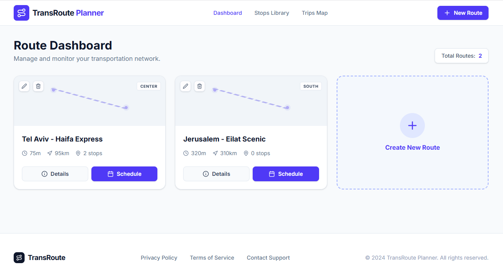

---

### Screen 2 — Trips Network Map

Interactive map visualization of all scheduled trips across the country, with a live panel showing active and in-progress trips and their passenger counts.

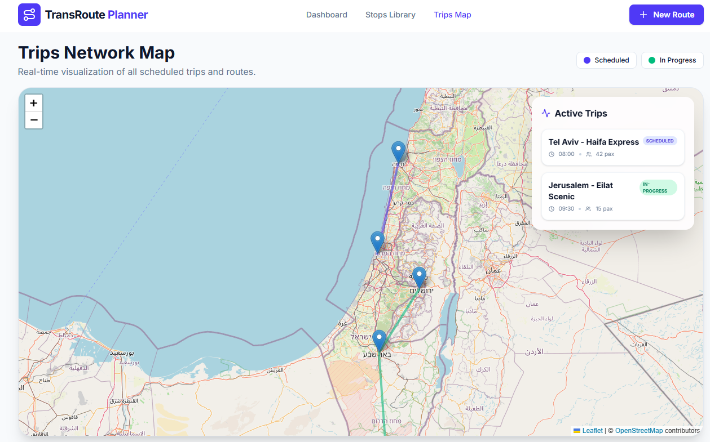

---

### Screen 3 — Schedule New Trip

Form for creating a new trip instance: select route, set date and departure time, specify expected passengers, and assign a fleet unit (vehicle and driver). Includes a real-time trip summary panel.

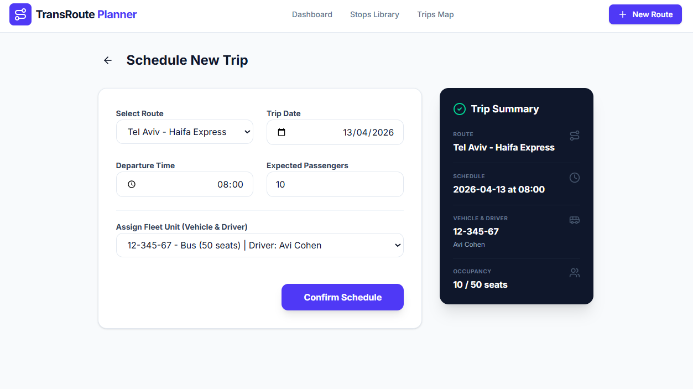

---

### Screen 4 — Route Details and Stop Management

Detailed view of a single route showing its segments, stop ordering, estimated arrival times, and GPS-linked site information. Includes an AI-based route optimization panel.

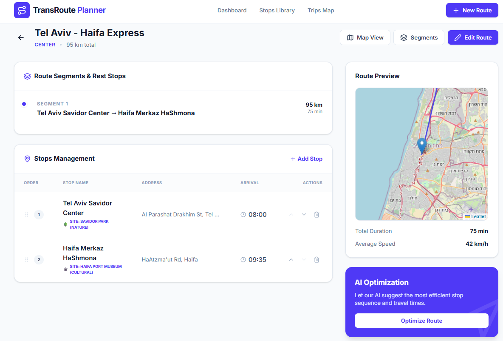

---

## 3. Entity-Relationship Diagram (ERD)

The ERD describes the conceptual data model: entities, their attributes, and the relationships between them, prior to relational schema translation.

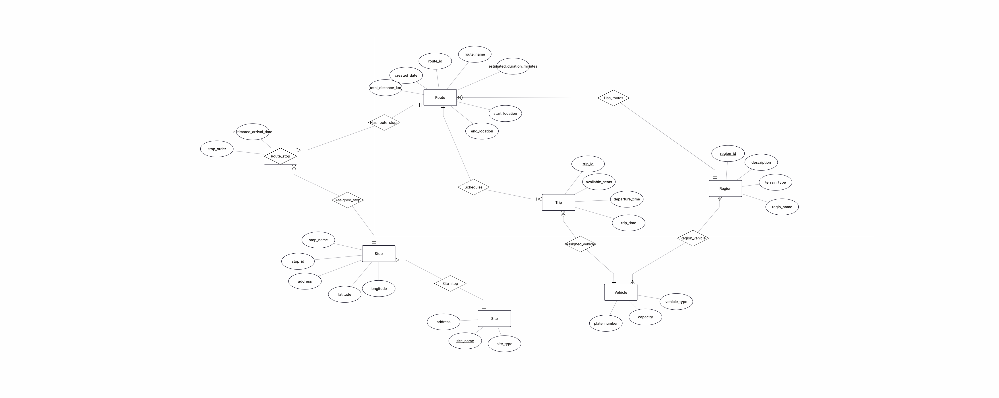

### Entity Relationship Overview

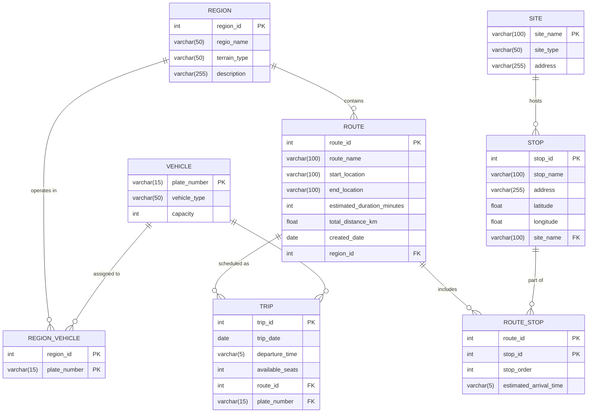

---

## 4. Data Structure Diagram (DSD)

The DSD shows the final relational schema: tables, column types, primary keys, foreign keys, and referential constraints.

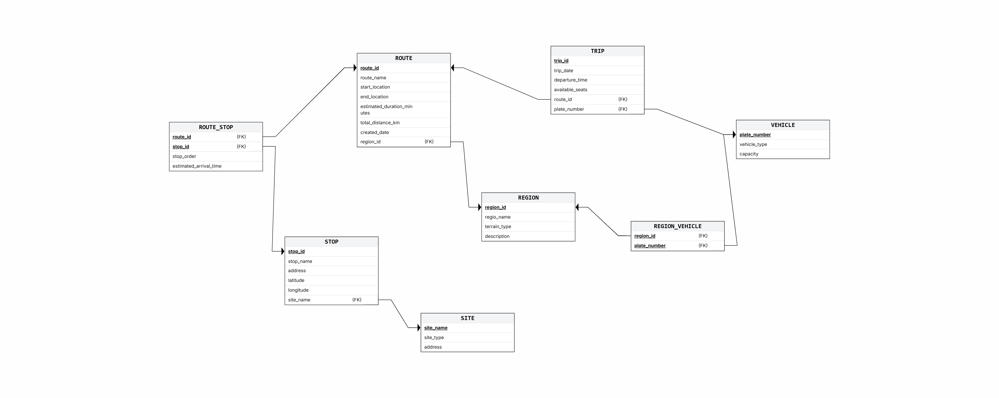

### Dependency Flow

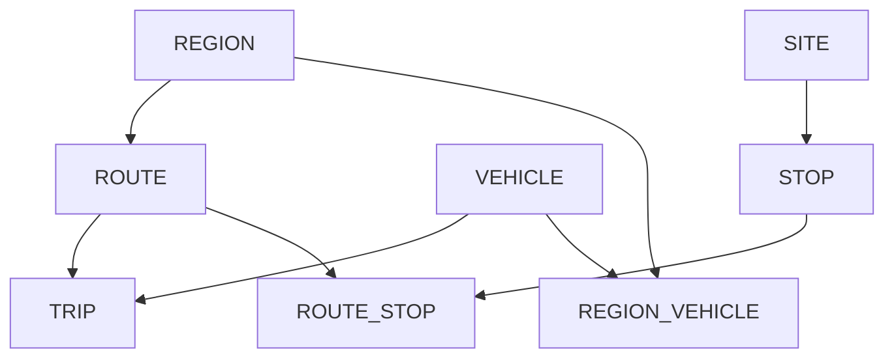

---

## 5. Data Dictionary

### VEHICLE

Stores the fleet of transport vehicles used for tour excursions.

| Column | Type | Length | Key | Required | Constraint | Description |
|--------|------|--------|-----|----------|------------|-------------|
| `plate_number` | VARCHAR | 15 | PK | Yes | — | Unique vehicle registration plate |
| `vehicle_type` | VARCHAR | 50 | — | Yes | — | Vehicle category (Bus, Minibus, Van, etc.) |
| `capacity` | INT | — | — | Yes | `> 0` | Maximum passenger seating capacity |

---

### REGION

Defines the geographic zones in which tour routes operate.

| Column | Type | Length | Key | Required | Constraint | Description |
|--------|------|--------|-----|----------|------------|-------------|
| `region_id` | INT | — | PK | Yes | — | Unique region identifier |
| `regio_name` | VARCHAR | 50 | — | Yes | — | Region name |
| `terrain_type` | VARCHAR | 50 | — | Yes | — | Terrain category (Urban, Mountain, Coastal, etc.) |
| `description` | VARCHAR | 255 | — | No | — | Free-text description |

---

### ROUTE

Defines tour routes including source, destination, total distance, and estimated duration. Contains two meaningful DATE-type attributes across the schema — `created_date` here and `trip_date` in TRIP.

| Column | Type | Length | Key | Required | Constraint | Description |
|--------|------|--------|-----|----------|------------|-------------|
| `route_id` | INT | — | PK | Yes | — | Unique route identifier |
| `route_name` | VARCHAR | 100 | — | Yes | — | Display name of the route |
| `start_location` | VARCHAR | 100 | — | Yes | — | Departure point |
| `end_location` | VARCHAR | 100 | — | Yes | — | Destination point |
| `estimated_duration_minutes` | INT | — | — | Yes | `> 0` | Estimated travel time in minutes |
| `total_distance_km` | FLOAT | — | — | Yes | `>= 0` | Total route length in kilometers |
| `created_date` | DATE | — | — | Yes | — | Date the route was first defined |
| `region_id` | INT | — | FK | Yes | — | Operating region (references REGION) |

---

### SITE

Represents tourist sites and points of interest that stops are physically located at.

| Column | Type | Length | Key | Required | Constraint | Description |
|--------|------|--------|-----|----------|------------|-------------|
| `site_name` | VARCHAR | 100 | PK | Yes | — | Unique site name (natural key) |
| `site_type` | VARCHAR | 50 | — | Yes | — | Type of site (Nature Park, Museum, Central Station, etc.) |
| `address` | VARCHAR | 255 | — | No | — | Physical address |

---

### STOP

A physical boarding or alighting location along a route, associated with a tourist site and identified by GPS coordinates.

| Column | Type | Length | Key | Required | Constraint | Description |
|--------|------|--------|-----|----------|------------|-------------|
| `stop_id` | INT | — | PK | Yes | — | Unique stop identifier |
| `stop_name` | VARCHAR | 100 | — | Yes | — | Stop display name |
| `address` | VARCHAR | 255 | — | Yes | — | Street address |
| `latitude` | FLOAT | — | — | Yes | `-90 to 90` | GPS latitude coordinate |
| `longitude` | FLOAT | — | — | Yes | `-180 to 180` | GPS longitude coordinate |
| `site_name` | VARCHAR | 100 | FK | Yes | — | Associated site (references SITE) |

---

### TRIP

An instance of a scheduled tour: a specific route operated on a specific date by a specific vehicle.

| Column | Type | Length | Key | Required | Constraint | Description |
|--------|------|--------|-----|----------|------------|-------------|
| `trip_id` | INT | — | PK | Yes | — | Unique trip identifier |
| `trip_date` | DATE | — | — | Yes | — | Date of the trip |
| `departure_time` | VARCHAR | 5 | — | Yes | — | Departure time in HH:MM format |
| `available_seats` | INT | — | — | Yes | `>= 0` | Number of seats remaining |
| `route_id` | INT | — | FK | Yes | — | Route being followed (references ROUTE) |
| `plate_number` | VARCHAR | 15 | FK | Yes | — | Vehicle assigned (references VEHICLE) |

---

### ROUTE\_STOP

Junction table representing the ordered sequence of stops along a route. Resolves the many-to-many relationship between ROUTE and STOP.

| Column | Type | Length | Key | Required | Constraint | Description |
|--------|------|--------|-----|----------|------------|-------------|
| `route_id` | INT | — | PK + FK | Yes | — | Route (references ROUTE) |
| `stop_id` | INT | — | PK + FK | Yes | — | Stop (references STOP) |
| `stop_order` | INT | — | — | Yes | `> 0` | Ordinal position of stop within the route |
| `estimated_arrival_time` | VARCHAR | 5 | — | Yes | UNIQUE(route\_id, stop\_order) | Expected arrival time in HH:MM format |

---

### REGION\_VEHICLE

Junction table representing the many-to-many assignment of vehicles to geographic regions.

| Column | Type | Length | Key | Required | Constraint | Description |
|--------|------|--------|-----|----------|------------|-------------|
| `region_id` | INT | — | PK + FK | Yes | — | Region (references REGION) |
| `plate_number` | VARCHAR | 15 | PK + FK | Yes | — | Vehicle (references VEHICLE) |

---

## 6. Design Decisions

### Schema Design Rationale

| Decision | Justification |
|----------|---------------|
| `plate_number` as VARCHAR(15) | Registration plates contain alphanumeric characters and hyphens; an integer key would not preserve their format |
| `departure_time` as VARCHAR(5) | Stores HH:MM format without timezone or daylight saving dependencies; avoids over-engineering for time-of-day values |
| `latitude` / `longitude` as FLOAT | Standard representation for GPS coordinates with sufficient precision |
| `UNIQUE(route_id, stop_order)` in ROUTE_STOP | Prevents two stops from occupying the same ordinal position on a route |
| `site_name` as natural primary key in SITE | Site names are inherently unique and serve as meaningful identifiers, eliminating the need for a surrogate key |
| Two junction tables (ROUTE_STOP, REGION_VEHICLE) | Both represent genuine many-to-many relationships that carry their own attributes |
| Two DATE attributes | `created_date` (ROUTE) tracks when a route was defined; `trip_date` (TRIP) records when a trip actually occurs |

### Third Normal Form (3NF) Verification

The schema satisfies 3NF:

- **1NF:** Every column holds a single atomic value; no repeating groups exist.
- **2NF:** In junction tables with composite primary keys (ROUTE_STOP, REGION_VEHICLE), all non-key attributes depend on the full composite key, not a subset.
- **3NF:** There are no transitive dependencies. Regional attributes (terrain type, description) are stored exclusively in REGION, not duplicated in ROUTE. Site attributes are stored exclusively in SITE, not in STOP.

---

## 7. Data Population Methods

A total of **40,500+ records** were inserted across all tables using three distinct methods.

| Table | Method | Record Count |
|-------|--------|-------------|
| VEHICLE | SQL `generate_series` | 500 |
| REGION | SQL `generate_series` | 500 |
| ROUTE | SQL `generate_series` | 600 |
| STOP | SQL `generate_series` | 500 |
| SITE | SQL `generate_series` | 500 |
| TRIP | Python script | 20,000 |
| ROUTE_STOP | Python script | ~20,000 |
| REGION_VEHICLE | Python script | 500 |

---

### Method 1 — SQL with `generate_series`

Base reference tables were populated directly in pgAdmin using PostgreSQL's built-in `generate_series()` function to produce deterministic, large-scale INSERT statements without external tooling.

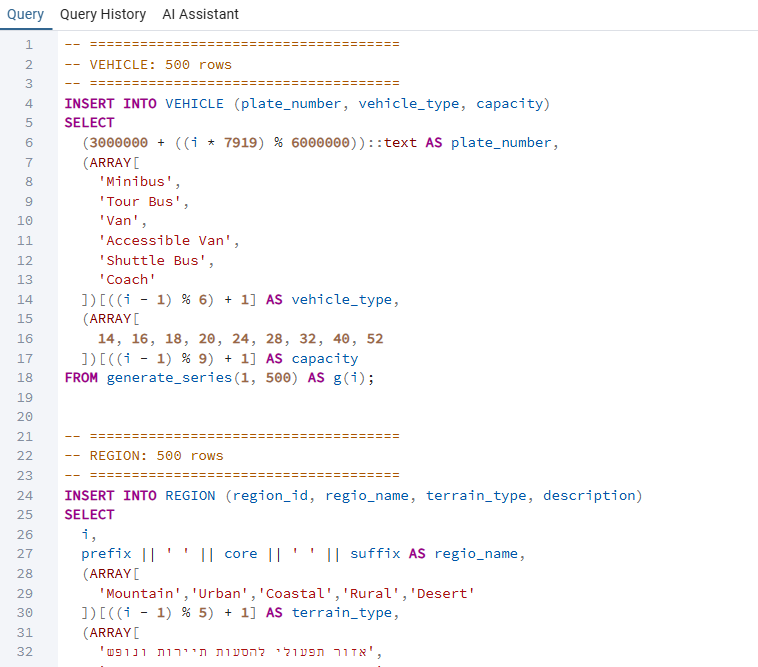

```sql
-- Example: insert 500 vehicles using generate_series
INSERT INTO VEHICLE (plate_number, vehicle_type, capacity)
SELECT
    (3000000 + ((i * 7919) % 6000000))::text AS plate_number,
    (ARRAY['Minibus','Tour Bus','Van','Accessible Van','Shuttle Bus','Coach'])
        [((i - 1) % 6) + 1]                  AS vehicle_type,
    (ARRAY[14, 16, 18, 20, 24, 28, 32, 40, 52])
        [((i - 1) % 9) + 1]                  AS capacity
FROM generate_series(1, 500) AS g(i);
```

Tables populated: `VEHICLE`, `REGION`, `ROUTE`, `STOP`, `SITE`

---

### Method 2 — Python Script (`psycopg2`)

High-volume tables were populated using a Python script that connects to PostgreSQL via `psycopg2`, reads existing reference data, and generates randomized records in bulk.

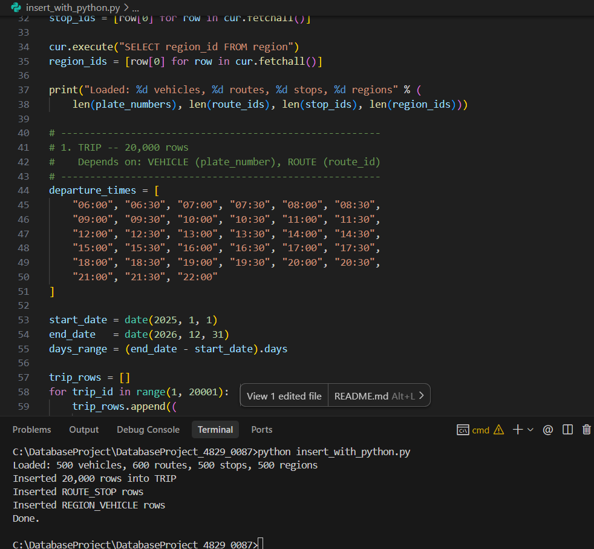

**Script:** [`insert_with_python.py`](./insert_with_python.py)

```
Loaded: 500 vehicles, 600 routes, 500 stops, 500 regions
Inserted 20,000 rows into TRIP
Inserted ROUTE_STOP rows
Inserted REGION_VEHICLE rows
Done.
```

Tables populated: `TRIP` (20,000 rows), `ROUTE_STOP` (~20,000 rows), `REGION_VEHICLE` (500 rows)

---

### Method 3 — Mockaroo (External Data Generation)

The Mockaroo platform was used to generate a realistic CSV dataset for the TRIP table, with field-level configuration for data types, ranges, and formats.

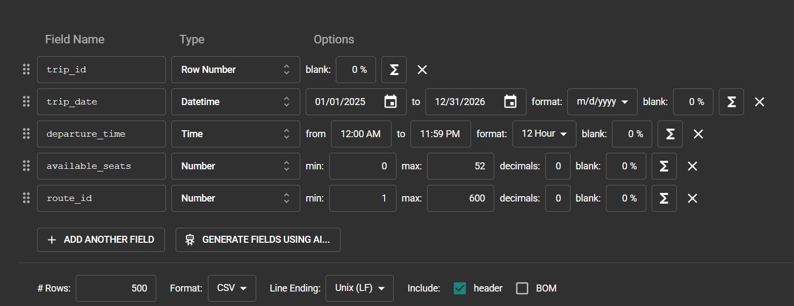

**Field configuration used:**

| Field | Type | Settings |
|-------|------|----------|
| `trip_id` | Row Number | Sequential |
| `trip_date` | Datetime | 01/01/2025 to 12/31/2026 |
| `departure_time` | Time | 12:00 AM to 11:59 PM, 12-hour format |
| `available_seats` | Number | 0 to 52, no decimals |
| `route_id` | Number | 1 to 600, no decimals |

Output format: CSV with header row, Unix line endings.
Import into the database: `Tools > Import/Export Data` in pgAdmin.

---

## 8. Backup and Restore

### Backup

The database was backed up using the pgAdmin 4 backup utility (pg_dump) on April 14, 2026.

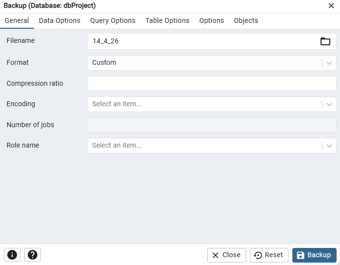

| Parameter | Value |
|-----------|-------|
| Filename | `14_4_26` |
| Format | Custom |
| Database | `dbProject` |
| Tool | pgAdmin 4 — Backup dialog |

The equivalent command-line operation:

```bash
pg_dump -U <username> -F c -f "14_4_26" dbProject
```

---

### Restore

The backup file was restored on a separate machine to verify integrity.
The restore was performed using pgAdmin 4's **Restore** dialog with the same backup file (`14_4_26`) in Custom or tar format.


| Parameter | Value |
|-----------|-------|
| Filename | `14_4_26` |
| Format | Custom or tar |
| Database | `db` |
| Tool | pgAdmin 4 — Restore dialog |

The backup file was restored on a separate machine to verify integrity:

```bash
pg_restore -U <username> -d dbProject "14_4_26"
```

---

## 9. Project Structure

```
DBProject/
|
|-- phase1/
|   |-- createTables.sql
|   |-- dropTables.sql
|   |-- insertTables.sql
|   |-- selectAll.sql
|   |-- ERD.png
|   |-- DSD.png
|   |
|   |-- Programing/
|   |   |-- insert_with_python.py
|   |
|   |-- FilesMockaroo/
|       |-- MOCK_DATA.csv
|
|-- screenshots/
|   |-- screen_dashboard.png
|   |-- screen_map.png
|   |-- screen_schedule.png
|   |-- screen_route_details.png
|   |-- ERD.png
|   |-- DSD.png
|   |-- insert_python.png
|   |-- insert_sql_generate.png
|   |-- insert_mockaroo.png
|   |-- backup.png
|   |-- Screenshot 2026-04-15 014318.png   ← restore dialog
|
|-- init-db/
|   |-- 01-schema.sql
|   |-- 02-seed-data.sql
|
|-- insert_with_python.py
|-- docker-compose.yml
|-- README.md
```

---

## Technologies Used

| Component | Technology |
|-----------|------------|
| Database | PostgreSQL 16 |
| Container | Docker Compose |
| GUI Client | pgAdmin 4 |
| Scripting | Python 3 (psycopg2) |
| Data Generation | Mockaroo, PostgreSQL generate_series |
| Application Design | Google AI Studio |

---

## Live Application

The prototype application built with Google AI Studio is available at the following link:

[https://ai.studio/apps/72d023cf-62c3-4e57-b361-48b2a41a6f65](https://ai.studio/apps/72d023cf-62c3-4e57-b361-48b2a41a6f65)
