# פרויקט מסדי נתונים: TransRoute Planner - שלב ב'

**מגישות:** [אפרת ווילינגר] · [איילה עוזרי]  

---

## תוכן עניינים
1. [הקדמה](#הקדמה)
2. [שאילתות SELECT מורכבות - כפולות והשוואת יעילות](#שאילתות-select-מורכבות---כפולות-והשוואת-יעילות)
3. [שאילתות SELECT נוספות](#שאילתות-select-נוספות)
4. [שאילתות UPDATE ו-DELETE](#שאילתות-update-ו-delete)
5. [אילוצים (Constraints) - דוח מוטיבציה והדגמה](#אילוצים-constraints---דוח-מוטיבציה-והדגמה)
6. [עסקאות: COMMIT ו-ROLLBACK](#עסקאות-commit-ו-rollback)
7. [אינדקסים (Indexes) - דוח מוטיבציה, תועלת וזמני ריצה](#אינדקסים-indexes---דוח-מוטיבציה-תועלת-וזמני-ריצה)
8. [הגשה וגיבוי](#הגשה-וגיבוי)

---

## הקדמה
בשלב ב' של פרויקט TransRoute Planner, אנו מתמקדים בתשאול בסיס הנתונים (שאילתות SELECT מורכבות), עדכון ומחיקת נתונים, הוספת אילוצים לשמירה על שלמות הנתונים (Data Integrity), שימוש בעסקאות (Transactions), ואופטימיזציה של ביצועים בעזרת אינדקסים. כלל השאילתות הותאמו למסכים שאופיינו במערכת, כמו לוח הבקרה (Dashboard), פירוט המסלולים, ומערכת זימון הנסיעות.

---

## שאילתות SELECT מורכבות - כפולות והשוואת יעילות
בפרק זה מוצגות 4 שאילתות מורכבות, אשר נכתבו ב-2 תצורות שונות כדי לבחון את ההבדלים ביעילות הביצוע.

### 1. שאילתת Dashboard - מסלולים, אזורים וכמות תחנות
**תיאור השאילתא:** שליפת פרטי מסלול, שם האזור בו הוא נמצא, וספירה של סך התחנות המשויכות לאותו מסלול. משמשת עבור מסך ה-Dashboard הראשי.

**תצורה א' (JOIN ו-GROUP BY):**
```sql
SELECT r.route_id, r.route_name, reg.regio_name, r.estimated_duration_minutes, r.total_distance_km, COUNT(rs.stop_id) AS total_stops
FROM route r
JOIN region reg ON r.region_id = reg.region_id
LEFT JOIN route_stop rs ON r.route_id = rs.route_id
GROUP BY r.route_id, r.route_name, reg.regio_name, r.estimated_duration_minutes, r.total_distance_km
ORDER BY r.route_id;
```

**תצורה ב' (Subquery בסעיף ה-SELECT):**
```sql
SELECT r.route_id, r.route_name, reg.regio_name, r.estimated_duration_minutes, r.total_distance_km,
    (SELECT COUNT(*) FROM route_stop rs WHERE rs.route_id = r.route_id) AS total_stops
FROM route r
JOIN region reg ON r.region_id = reg.region_id
ORDER BY r.route_id;
```
> **הסבר יעילות:** תצורה א' (שימוש ב-JOIN ו-GROUP BY) מבוצעת על ידי חיבור הקבוצות באופן גורף, מה שמאפשר למנוע מסד הנתונים לעשות אופטימיזציה עם Hash Aggregate. תצורה ב' משתמשת בתת-שאילתה התלויה (Correlated Subquery), מה שעלול לגרום להרצת תת-השאילתה מחדש עבור כל שורה בטבלת המסלולים, דבר שמייקר משמעותית את זמן הריצה כאשר כמות הנתונים גדלה. לכן, לרוב תצורה א' יעילה יותר בסריקות רחבות.

**צילום הרצה תצורה א':**  
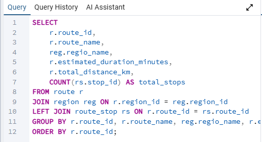  
**צילום תוצאה תצורה א':**  
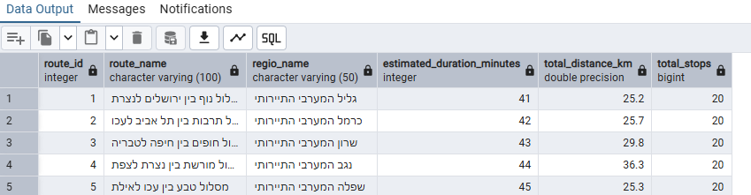

**צילום הרצה תצורה ב':**  
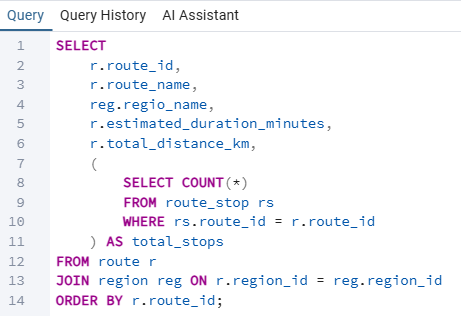  
**צילום תוצאה תצורה ב':**  
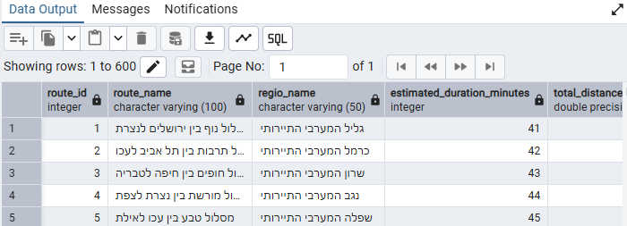

---

### 2. שאילתת Schedule - נסיעות לפי תאריך מסוים
**תיאור השאילתא:** שליפת כלל הנסיעות בשנת 2025, תוך פירוק שדה התאריך לימים, חודשים ושנים באמצעות פעולת EXTRACT.

**תצורה א' (JOIN משולש):**
```sql
SELECT t.trip_id, t.trip_date, EXTRACT(YEAR FROM t.trip_date) AS trip_year, EXTRACT(MONTH FROM t.trip_date) AS trip_month, EXTRACT(DAY FROM t.trip_date) AS trip_day, t.departure_time, r.route_name, v.plate_number, v.vehicle_type, t.available_seats
FROM trip t
JOIN route r ON t.route_id = r.route_id
JOIN vehicle v ON t.plate_number = v.plate_number
WHERE t.trip_date BETWEEN DATE '2025-01-01' AND DATE '2025-12-31'
ORDER BY t.trip_date, t.departure_time;
```

**תצורה ב' (EXISTS לתנאי קיום):**
```sql
SELECT t.trip_id, t.trip_date, t.departure_time, t.available_seats, t.route_id, t.plate_number
FROM trip t
WHERE EXISTS (
    SELECT 1 FROM route r WHERE r.route_id = t.route_id
)
AND t.trip_date BETWEEN DATE '2025-01-01' AND DATE '2025-12-31'
ORDER BY t.trip_date, t.departure_time;
```
> **הסבר יעילות:** תצורה ב' המשתמשת ב-EXISTS יעילה במקרים שבהם אנו רוצים לבדוק התאמה אך איננו זקוקים לעמודות מטבלת ה-ROUTE. פונקציית ה-EXISTS עוצרת בסריקה ברגע שנמצאת ההתאמה הראשונה (Short-Circuit), מה שחוסך משאבים בהשוואה ל-JOIN מלא (כמו בתצורה א') שקורא את כל הרשומות התואמות ועשוי לייצר כפילויות לפני הסיווג.

**צילום הרצה ותוצאה תצורה א':**  
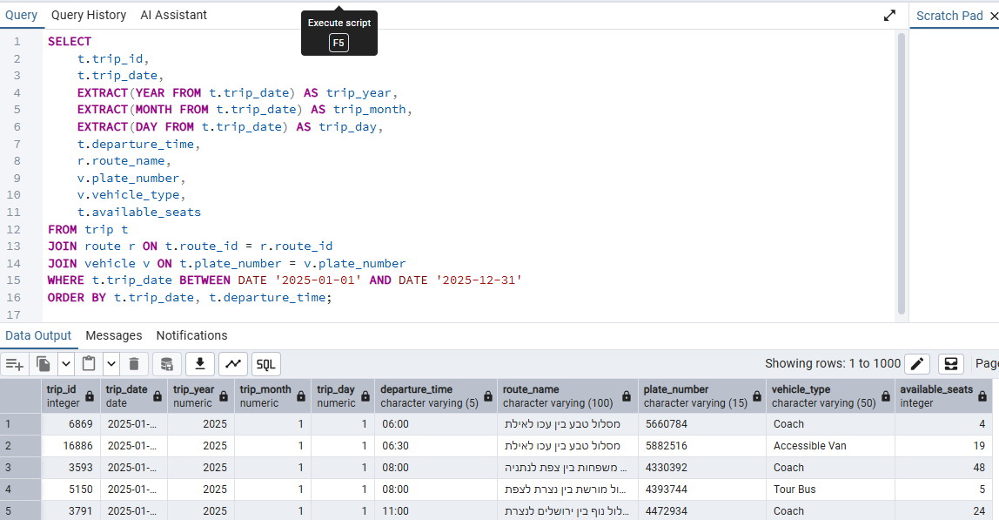

**צילום הרצה ותוצאה תצורה ב':**  
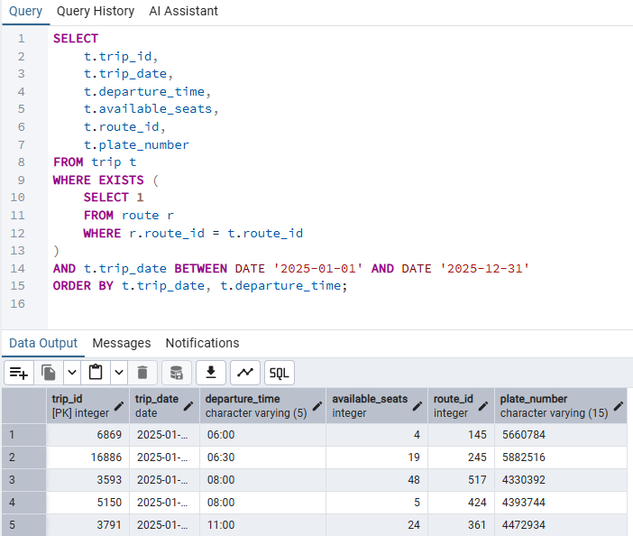

---

### 3. כמות מסלולים לפי אזור גיאוגרפי
**תיאור השאילתא:** מציגה אילו אזורים עמוסים יותר וכוללים יותר מסלולים פעילים.

**תצורה א' (LEFT JOIN):**
```sql
SELECT reg.region_id, reg.regio_name, reg.terrain_type, COUNT(r.route_id) AS total_routes
FROM region reg
LEFT JOIN route r ON reg.region_id = r.region_id
GROUP BY reg.region_id, reg.regio_name, reg.terrain_type
ORDER BY total_routes DESC;
```

**תצורה ב' (Subquery):**
```sql
SELECT reg.region_id, reg.regio_name, reg.terrain_type,
    (SELECT COUNT(*) FROM route r WHERE r.region_id = reg.region_id) AS total_routes
FROM region reg
ORDER BY total_routes DESC;
```
> **הסבר יעילות:** בדומה לשאילתה 1, שימוש ב-LEFT JOIN ו-GROUP BY ברוב מנועי מסדי הנתונים יעבור אופטימיזציה יעילה יותר לריצה המונית, בהשוואה לשאילתה מקוננת שרצה פר-שורה באזור (אלא אם ה-Optimizer מצליח לשטח אותה לפעולת Hash Join).

**צילום הרצה ותוצאה תצורה א':**  
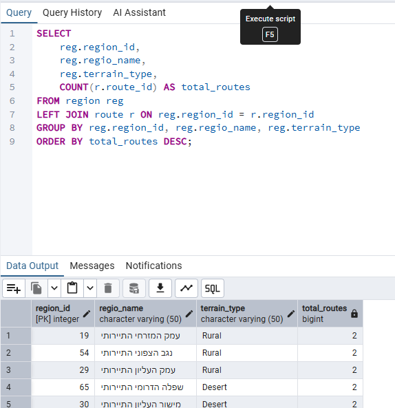

**צילום הרצה ותוצאה תצורה ב':**  
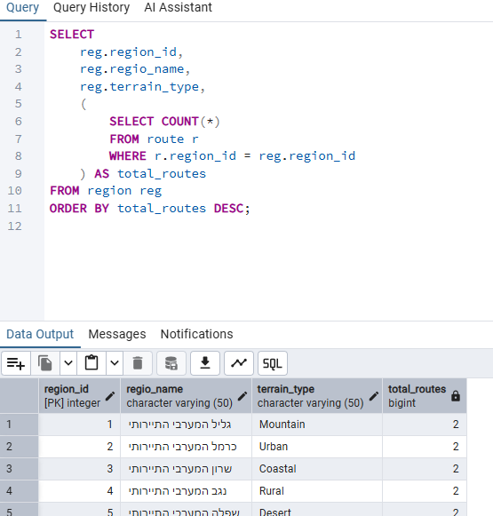

---

### 4. רכבים פעילים וסך נסיעות
**תיאור השאילתא:** איתור כלי רכב המבצעים מספר רב של נסיעות, לפי מספר הרישוי. 

**תצורה א' (JOIN וסיווג):**
```sql
SELECT v.plate_number, v.vehicle_type, v.capacity, COUNT(t.trip_id) AS total_trips
FROM vehicle v
JOIN trip t ON v.plate_number = t.plate_number
GROUP BY v.plate_number, v.vehicle_type, v.capacity
ORDER BY total_trips DESC
LIMIT 10;
```

**תצורה ב' (שימוש ב-IN וקיבוץ בתוך ה-Subquery):**
```sql
SELECT v.plate_number, v.vehicle_type, v.capacity
FROM vehicle v
WHERE v.plate_number IN (
    SELECT t.plate_number FROM trip t GROUP BY t.plate_number HAVING COUNT(*) > 5
)
ORDER BY v.plate_number;
```
> **הסבר יעילות:** תצורה ב' מאפשרת הקטנה של סט הנתונים לפני החיבור לטבלת הרכבים. במקום לבצע JOIN ל-20,000 נסיעות ורק אז לספור, התת-שאילתה מבצעת סריקה אגרגטיבית עצמאית על טבלת הנסיעות ומעבירה רק רשימה קטנה של לוחית רישוי לפקודת ה-IN, מה שעשוי לשפר משמעותית ביצועים כאשר טבלת הרכבים גדולה.

**צילום הרצה ותוצאה תצורה א':**  
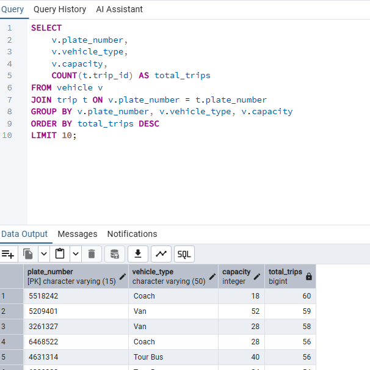

**צילום הרצה ותוצאה תצורה ב':**  
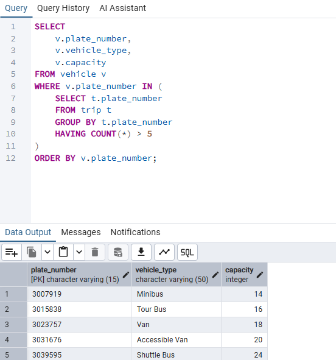

---

## שאילתות SELECT נוספות
**שאילתה 5: תפוסת נסיעה (חישוב באחוזים ובמספרים)**
שאילתה מורכבת מ-3 טבלאות החישוב מציג את אחוז התפוסה של הרכב הנגזר מכמות המושבים הפנויים והקיבולת המקורית.
```sql
SELECT t.trip_id, r.route_name, t.trip_date, t.departure_time, v.plate_number, v.vehicle_type, v.capacity, t.available_seats,
    (v.capacity - t.available_seats) AS occupied_seats,
    ROUND(((v.capacity - t.available_seats)::numeric / v.capacity) * 100, 2) AS occupancy_percent
FROM trip t
JOIN route r ON t.route_id = r.route_id
JOIN vehicle v ON t.plate_number = v.plate_number
WHERE t.trip_id = 1;
```

**צילום הרצה ותוצאה:**  


**שאילתה 6: סדר תחנות במסלול - Route Details**
מצרפת 4 טבלאות כדי להציג את רשימת התחנות המסודרת המדויקת למסלול ספציפי, כולל שם האתר וזמן הגעה.
```sql
SELECT r.route_name, rs.stop_order, s.stop_name, s.address, rs.estimated_arrival_time, si.site_name, si.site_type
FROM route_stop rs
JOIN route r ON rs.route_id = r.route_id
JOIN stop s ON rs.stop_id = s.stop_id
JOIN site si ON s.site_name = si.site_name
WHERE r.route_id = 1
ORDER BY rs.stop_order;
```

**צילום הרצה ותוצאה:**  


**שאילתה 7: ממוצע משך זמן ומרחק במסלולים לפי סוג אזור**
מבוססת GROUP BY עם HAVING המחשבת ממוצעים מעוגלים לפי נתונים מספריים.
```sql
SELECT reg.regio_name, reg.terrain_type, COUNT(r.route_id) AS routes_count, ROUND(AVG(r.estimated_duration_minutes), 2) AS avg_duration, ROUND(AVG(r.total_distance_km)::numeric, 2) AS avg_distance
FROM region reg
JOIN route r ON reg.region_id = r.region_id
GROUP BY reg.regio_name, reg.terrain_type
HAVING COUNT(r.route_id) > 0
ORDER BY avg_duration DESC;
```

**צילום הרצה ותוצאה:**  
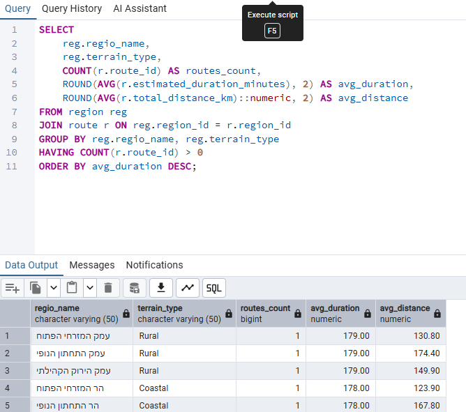

**שאילתה 8: פילוח זמנים עמוסים בנסיעות (EXTRACT)**
שימוש ב-EXTRACT לחילוץ שנה, חודש ויום לצורך סטטיסטיקת עומסים.
```sql
SELECT EXTRACT(YEAR FROM trip_date) AS trip_year, EXTRACT(MONTH FROM trip_date) AS trip_month, EXTRACT(DAY FROM trip_date) AS trip_day, COUNT(*) AS total_trips
FROM trip
GROUP BY EXTRACT(YEAR FROM trip_date), EXTRACT(MONTH FROM trip_date), EXTRACT(DAY FROM trip_date)
ORDER BY total_trips DESC;
```

**צילום הרצה ותוצאה:**  
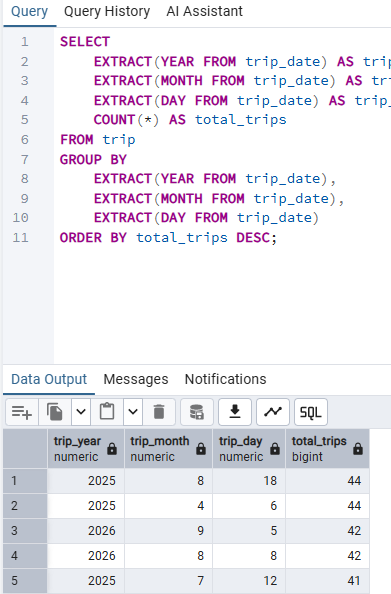

---

## שאילתות UPDATE ו-DELETE

### שאילתות UPDATE:
**1. איפוס מקומות פנויים בנסיעות עבר:** (נסיעות מתאריכים ישנים שבהן המקומות כבר לא "פנויים" באמת).
```sql
UPDATE trip SET available_seats = 0 WHERE trip_date < CURRENT_DATE AND available_seats > 0;
```
**צילום בסיס נתונים לפני העדכון:**  
  
**צילום הרצה:**  
  
**צילום בסיס נתונים אחרי העדכון:**  
  

**2. העלאת משך זמן משוער למסלולים ארוכים:**
```sql
UPDATE route SET estimated_duration_minutes = estimated_duration_minutes + 15 WHERE total_distance_km > 150;
```
**צילום בסיס נתונים לפני העדכון:**  
  
**צילום הרצה:**  
  
**צילום בסיס נתונים אחרי העדכון:**  
  

**3. עדכון ייעוד אזור ל"Tourism":** 
```sql
UPDATE region SET terrain_type = 'Tourism' WHERE description LIKE '%תיירות%';
```
**צילום בסיס נתונים לפני העדכון:**  
  
**צילום הרצה:**  
  
**צילום בסיס נתונים אחרי העדכון:**  
  

### שאילתות DELETE:
**1. מחיקת שיוך אזור-רכב בלי נסיעות בפועל:**
```sql
DELETE FROM region_vehicle
WHERE region_id IN (
    SELECT region_id
    FROM region
    LIMIT 2
);
```
**צילום בסיס נתונים לפני העדכון:**  
  
**צילום הרצה:**  
  
**צילום בסיס נתונים אחרי העדכון:**  
  

**2. מחיקת נסיעות ללא מקומות פנויים מתאריך עבר:**
```sql
DELETE FROM trip WHERE trip_date < CURRENT_DATE AND available_seats = 0;
```
**צילום בסיס נתונים לפני העדכון:**  
  
**צילום הרצה:**  
  
**צילום בסיס נתונים אחרי העדכון:**  
  

**3. מחיקת תחנות שלא משויכות לשום מסלול:**
```sql
DELETE FROM route_stop WHERE stop_id IN (1, 2);
```
**צילום בסיס נתונים לפני העדכון:**  
  
**צילום הרצה:**  
  
**צילום בסיס נתונים אחרי העדכון:**  
  

---

## אילוצים (Constraints) - דוח מוטיבציה והדגמה

**דוח מוטיבציה:** הוספת האילוצים נועדה לשמור על שלמות הנתונים (Data Integrity). במערכות מורכבות שמקבלות מידע ממספר גורמים, ייתכנו שגיאות הקלדה שמובילות להזנת מידע שלא ייתכן במציאות. הגבלת הנתונים ברמת מסד הנתונים מונעת מבאגים קריטיים להיווצר ומונעת קריסות של חזית המערכת.

**אילוץ 1: קיבולת רכב חייבת להיות חיובית**
מונע הזנת רכבים עם מספר מושבים שלילי.
```sql
ALTER TABLE vehicle ADD CONSTRAINT chk_vehicle_capacity_positive CHECK (capacity > 0);
-- בדיקת שגיאה: (נסיון להכניס מינוס 5)
INSERT INTO vehicle (plate_number, vehicle_type, capacity) VALUES ('9999999', 'Bus', -5);
```

**אילוץ 2: כמות מושבים פנויים אינה יכולה להיות שלילית**
כדי למנוע "אובר-בוקינג" בנסיעה (קריטי למערכת תזמון).
```sql
ALTER TABLE trip ADD CONSTRAINT chk_trip_available_seats_non_negative CHECK (available_seats >= 0);
-- בדיקת שגיאה:
INSERT INTO trip (trip_id, trip_date, departure_time, available_seats, route_id, plate_number) VALUES (999999, '2025-05-01', '08:00', -3, 1, '3007919');
```

**אילוץ 3: אורך מסלול חייב להיות חיובי**
מסלול חייב לכלול מרחק ממשי מעל 0.
```sql
ALTER TABLE route ADD CONSTRAINT chk_route_distance_positive CHECK (total_distance_km > 0);
```

**תמונות הדגמה לאילוצים:**


---

## עסקאות: COMMIT ו-ROLLBACK

השתמשנו בעסקאות (Transactions) בבלוק של `BEGIN;` על מנת לבדוק עדכונים ולבטל אותם במידת הצורך.

**תהליך ROLLBACK (ביטול פעולה על בסיס הנתונים):**
```sql
BEGIN;
UPDATE trip SET available_seats = available_seats - 1 WHERE trip_id = 1;
-- *הדפסת הנתונים לפני ואחרי (1 מושב פחות)*
ROLLBACK;
-- *הדפסת הנתונים אחרי החזרה - הערך חזר לקדמותו.*
```

**תהליך COMMIT (אישור פעולה לבסיס הנתונים):**
```sql
BEGIN;
UPDATE route SET estimated_duration_minutes = estimated_duration_minutes + 10 WHERE route_id = 1;
-- *הדפסה להראות שזמן המסלול גדל*
COMMIT;
-- *הדפסה סופית שמראה כי הערך החדש נשמר.*
```

**תמונות הדגמה לשלבי העסקאות (לפני, הפעולה ואחרי):**


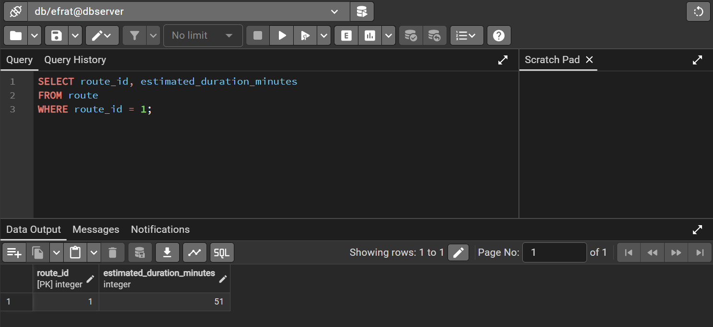

---

## אינדקסים (Indexes) - דוח מוטיבציה, תועלת וזמני ריצה

**מוטיבציה ותועלת:** אינדקס משמש כמו תוכן עניינים למסד הנתונים. במקום שהמנוע יסרוק שורה אחר שורה כדי למצוא תאריך מסוים או מזהה (Sequential Scan - סריקה רציפה O(N)), האינדקס בונה עץ המאפשר חיפוש יעיל ומהיר ביותר (Index Scan או Bitmap Heap Scan - חיפוש לוגריתמי O(log N)). זה קריטי בטבלאות גדולות כמו `trip` או בטבלאות קשר בזמן ביצוע JOIN.

**אינדקס 1: על תאריך הנסיעה `idx_trip_date` בטבלת TRIP**
מסייע בשליפות לפי תאריכים.
```sql
CREATE INDEX idx_trip_date ON trip(trip_date);
```
**אינדקס 2: על עמודת המפתח הזר `route_id` בטבלת הקשר ROUTE_STOP**
מסייע בשאילתות ששולפות את כל התחנות עבור מסלול נתון.
```sql
CREATE INDEX idx_route_stop_route ON route_stop(route_id);
```
**אינדקס 3: על המפתח הזר `region_id` בטבלת ROUTE**
מסייע בעת סינון מסלולים לפי אזורים.
```sql
CREATE INDEX idx_route_region ON route(region_id);
```

**בדיקת EXPLAIN ANALYZE:**
בדקנו לפני הוספת האינדקסים ואחרי הוספתם באמצעות `EXPLAIN ANALYZE`. 
- **לפני האינדקס:** ניתן לראות בתוצאות שמסד הנתונים ביצע "Seq Scan" (סריקה מלאה) וה-Execution Time היה גבוה יותר.
- **אחרי האינדקס:** תכנון השאילתה מראה "Index Scan" או "Bitmap Index Scan", וניתן לראות צמצום דרמטי בעלות הריצה (Cost) ובזמן (Execution Time).
**תוצאות הריצה של ה-Explain לפני ואחרי האינדקסים:**


---

## הגשה וגיבוי
- כלל הפקודות שמורות בתיקייה `phase2/` (בקבצי ה-SQL המצורפים).
- נוצר קובץ גיבוי מעודכן בשם `backup2` הכולל את תצורת המסד העדכנית עם האילוצים, האינדקסים, ונתונים שעודכנו.
- הפרויקט מקודד ומוכן להגשה דרך יצירת ה-TAG המתאים בגיט.
