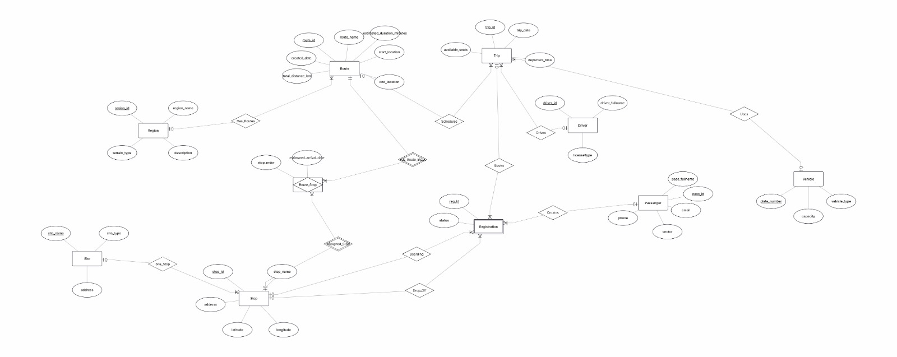

# דוח פרויקט - שלב ג' (אינטגרציה ומבטים)

**הקדמה:**
בשלב זה של הפרויקט ביצענו אינטגרציה מלאה בין בסיס הנתונים המקורי שלנו (TransRoute Planner - ניהול מסלולים ותחנות) לבין בסיס נתונים של פרויקט מקביל באגף השני (אגף רישום נוסעים ושיבוץ נהגים - מזהה 5626). בחרנו ב**שיטת אינטגרציה א'**, שבה שילבנו את הטבלאות לבסיס נתונים אחד מאוחד בעזרת פקודות SQL, תוך עדכון המבנה ושמירה על הנתונים.

---

## תרשימי DSD ו-ERD לאחר האינטגרציה
במסגרת תהליך ההינדוס לאחור (Reverse Engineering) ושילוב בסיסי הנתונים, יצרנו תרשימים מעודכנים המציגים את הקשרים החדשים שנוצרו.

### DSD לאחר אינטגרציה


## אלגוריתם הינדוס לאחור (Reverse Engineering)

קיבלנו גיבוי (backup) של בסיס הנתונים של האגף המקביל (מזהה 5626). מתוך הגיבוי שחזרנו את הסכמה ויצרנו ממנה ERD לפי האלגוריתם הבא:

### שלב 1 — שחזור רשימת הטבלאות
לאחר שחזור הגיבוי לבסיס נתונים זמני, הרצנו `\dt` ב-psql וקיבלנו את רשימת הטבלאות:
`driver`, `includes`, `passenger`, `registration`, `route`, `stop`, `trip`, `vehicle`
→ **כל טבלה הופכת לישות (Entity) ב-ERD.**

### שלב 2 — זיהוי מפתחות ראשיים (Primary Keys)
עבור כל טבלה בדקנו את עמודות המפתח הראשי:
- `driver` → `driver_id` (PK)
- `passenger` → `pass_id` (PK)
- `registration` → `reg_id` (PK)
- `trip` → `trip_id` (PK)
- `vehicle` → `plate_number` (PK)
- `route` → `route_id` (PK)
- `stop` → `stop_id` (PK)
- `includes` → (`route_id`, `stop_id`) (PK מורכב)

→ **עמודת PK מייצגת את המזהה הייחודי של הישות.**

### שלב 3 — זיהוי מפתחות זרים (Foreign Keys) ויצירת קשרים
בדקנו את אילוצי ה-FOREIGN KEY בסכמה:
- `registration.pass_id` → `passenger.pass_id` : **Registration שייכת ל-Passenger** (N:1)
- `registration.trip_id` → `trip.trip_id` : **Registration שייכת ל-Trip** (N:1)
- `registration.boarding_stop_id` → `stop.stop_id` : **תחנת עלייה**
- `registration.dropoff_stop_id` → `stop.stop_id` : **תחנת ירידה**
- `trip.driver_id` → `driver.driver_id` : **Trip מבוצעת על ידי Driver** (N:1)
- `trip.plate_number` → `vehicle.plate_number` : **Trip מבוצעת ברכב Vehicle** (N:1)
- `includes.route_id` → `route.route_id` : **מסלול כולל תחנות**
- `includes.stop_id` → `stop.stop_id` : **תחנה שייכת למסלול**

→ **כל FK מייצג קשר (Relationship) בין שתי ישויות ב-ERD.**

### שלב 4 — זיהוי טבלאות קשר (Junction Tables)
הטבלה `includes` כוללת PK מורכב מ-`route_id` + `stop_id` שניהם FKs.
→ **זוהתה כטבלת קשר M:N בין Route לבין Stop.**

### שלב 5 — קביעת עוצמת הקשרים (Cardinality)
- נהג יכול לבצע נסיעות רבות → `driver` ←1:N→ `trip`
- רכב יכול לשמש בנסיעות רבות → `vehicle` ←1:N→ `trip`
- נוסע יכול להירשם להרשמות רבות → `passenger` ←1:N→ `registration`
- נסיעה יכולה לכלול הרשמות רבות → `trip` ←1:N→ `registration`
- מסלול ותחנה ← קשר M:N דרך `includes`

### שלב 6 — זיהוי תכונות (Attributes)
לכל ישות, כל שאר העמודות שאינן PK/FK מהוות **תכונות (Attributes)**:
- `driver`: `driver_fullname`, `licenseType`
- `passenger`: `pass_fullname`, `phone`, `email`, `sector`
- `trip`: `trip_date`, `departure_time`, `available_seats`
- `vehicle`: `vehicle_type`, `capacity`

### תוצאה — ERD שנוצר מהינדוס לאחור


---

### ERD המשולב לאחר אינטגרציה
ה-ERD הבא מציג את מבנה הישויות והקשרים של בסיס הנתונים המשולב לאחר מיזוג שני האגפים. ניתן לראות את הישויות המקוריות (Route, Region, Stop, Site, Vehicle) יחד עם הישויות החדשות מהאגף המקביל (Driver, Passenger, Registration).



---

## החלטות שנעשו בשלב האינטגרציה
כחלק מתהליך המיזוג של שתי המערכות, נדרשנו לקבל מספר החלטות תכנוניות:
1. **פתרון התנגשות שמות (Name Collisions):** מכיוון שבשתי המערכות המקוריות היו טבלאות בעלות שם זהה אך עם ייעוד או מבנה שונה (כמו טבלאות `route`, `stop`, `trip`, `vehicle`), החלטנו להוסיף סיומת מזהה (`_5626`) לטבלאות מהאגף המקביל לפני המיזוג. 
2. **התאמת טיפוסי נתונים:** זיהינו חוסר התאמה באורך המקסימלי של שדה `plate_number`. במערכת אחת הוא הוגדר קצר מדי. כהחלטת אינטגרציה, הרחבנו את אורך השדה (ל-`varchar(20)`) על מנת שיוכל להכיל את מספרי הרישוי של שתי המערכות.
3. **יצירת קשרים חדשים:** לאחר יצירת הטבלאות הייחודיות של האגף השני (`driver`, `passenger`, `registration`), הוספנו עמודת מפתח זר (`driver_id`) לטבלת הנסיעות המשולבת (`trip_5626`) כדי לקשר בין נסיעה לנהג שמבצע אותה.
4. **מחיקת כפילויות:** לאחר שוידאנו שכל המידע הדרוש נמצא בטבלאות הממוזגות עם התחיליות המתאימות, ביצענו מחיקה (DROP CASCADE) לטבלאות הכפולות המיותרות שלא היינו זקוקים להן יותר.

---

## הסבר מילולי של התהליך והפקודות (Integrate.sql)
התהליך הטכני של האינטגרציה בוצע במספר שלבים דרך שורת פקודות:
1. **שינוי שמות טבלאות ואינדקסים (ALTER TABLE RENAME):** 
   שינוי השמות של הטבלאות המקבילות והאינדקסים שלהן כדי למנוע דריסת נתונים בבסיס הנתונים המשותף. למשל: `ALTER TABLE route RENAME TO route_5626;`.
2. **התאמת עמודות (ALTER COLUMN TYPE):**
   תיקון טיפוס הנתונים כדי למנוע שגיאות גלישה: `ALTER COLUMN plate_number TYPE character varying(20);`.
3. **יצירת טבלאות חדשות מהאגף המקביל (CREATE TABLE):**
   יצירת הטבלאות החסרות `driver`, `passenger`, ו-`registration` כולל הגדרת מפתחות ראשיים (PK).
4. **הגדרת קשרי גומלין (ADD CONSTRAINT FOREIGN KEY):**
   - הוספת `driver_id` לטבלת הנסיעות.
   - קישור ההרשמות (`registration`) לטבלאות הנוסעים (`passenger`), הנסיעות (`trip_5626`) והתחנות (`stop_5626`).
5. **ניקוי סופי (DROP TABLE CASCADE):**
   שימוש בבלוק טרנזקציה `BEGIN; ... COMMIT;` על מנת להסיר את הטבלאות החופפות (כגון `includes`, `region_vehicle` הישן וכו') בצורה בטוחה.

*(קוד הפקודות המלא מופיע בקובץ `Integrate.sql` המצורף לפרויקט).*

---

## מבטים (Views) ושאילתות (Views.sql)

בשלב זה הוספנו 2 מבטים המייצגים נקודות מבט שונות על הנתונים: אחד מהזווית של ניהול המסלולים ותיזמון הנסיעות (האגף המקורי שלנו), והשני מהזווית של רישום הנוסעים (האגף המקביל). 

### מבט 1: schedule_trip_view
**תיאור מילולי:** מבט מנקודת המבט של האגף המקורי (ניהול מסלולים ונסיעות). המבט מציג נסיעות מתוזמנות באופן מלא, כולל פרטי המסלול (שם, נקודת מוצא, יעד), שם הנהג המשויך לנסיעה, פרטי הרכב (מספר רישוי, סוג, קיבולת) ומספר המושבים הפנויים. המבט משלב בין הטבלאות `trip_5626`, `route_5626`, `driver` ו-`vehicle_5626` ומאפשר למנהל לראות בבת אחת את כל המידע הנדרש לניהול תיזמון הנסיעות.

**קוד יצירת המבט:**
```sql
CREATE OR REPLACE VIEW schedule_trip_view AS
SELECT 
    t.trip_id, t.trip_date, t.departure_time, t.available_seats,
    r.route_name, r.start_location, r.end_location,
    d.driver_fullname,
    v.plate_number, v.vehicle_type, v.capacity
FROM trip_5626 t
JOIN route_5626 r ON t.route_id = r.route_id
JOIN driver d ON t.driver_id = d.driver_id
JOIN vehicle_5626 v ON t.plate_number = v.plate_number;
```

**שליפת נתונים מהמבט (SELECT *):**
```sql
SELECT * FROM schedule_trip_view;
```

**פלט (10 רשומות ראשונות):**

.png)

*(המבט מציג 1000 שורות בכל עמוד, עם 7 עמודים סה"כ — כלומר מאות נסיעות מתוזמנות. הנסיעות מקושרות לנהגים כמו Yael Avraham, Omer Biton, Nadav Barak וכלי רכב מסוגים Minibus, Accessible Van, Coach ועוד.)*

#### שאילתא 1 על מבט 1
**תיאור מילולי:** שליפת 10 הנסיעות הקרובות ביותר מהיום ואילך, מסודרות לפי תאריך ושעה. מאפשרת למנהל לראות את לוח הנסיעות הקרוב ומי נהג משויך לכל נסיעה.
**קוד השאילתא:**
```sql
SELECT
    trip_id,
    trip_date,
    departure_time,
    route_name,
    driver_fullname,
    plate_number,
    vehicle_type
FROM schedule_trip_view
WHERE trip_date >= CURRENT_DATE
ORDER BY trip_date, departure_time
LIMIT 10;
```

**פלט:**


#### שאילתא 2 על מבט 1
**תיאור מילולי:** שליפת נסיעות עם 10 מושבים פנויים או פחות, מסודרות מהנסיעה הקרובה לתפוסה מלאה. מאפשרת לנהל התרעות על נסיעות שמתמלאות.
**קוד השאילתא:**
```sql
SELECT
    trip_id,
    trip_date,
    departure_time,
    route_name,
    available_seats,
    driver_fullname,
    plate_number
FROM schedule_trip_view
WHERE available_seats <= 10
ORDER BY available_seats ASC;
```

**פלט:**


---

### מבט 2: passenger_trip_booking_view
**תיאור מילולי:** מבט מנקודת המבט של האגף החדש (ניהול נוסעים והרשמות). המבט מציג תמונה מלאה של כל הרשמה: פרטי הנוסע (שם, טלפון), פרטי ההרשמה (מספר, סטטוס), פרטי הנסיעה (תאריך, שעה, מושבים פנויים), פרטי המסלול (שם, מוצא, יעד), פרטי הנהג ורישיון, פרטי הרכב, ושמות תחנות העלייה והירידה. המבט משלב **8 טבלאות** (registration, passenger, trip_5626, route_5626, driver, vehicle_5626, stop_5626×2) ומאפשר לראות בשאילתה אחת את כל מסע הנוסע מרגע ההרשמה ועד היעד.

**קוד יצירת המבט:**
```sql
CREATE OR REPLACE VIEW passenger_trip_booking_view AS
SELECT
    p.pass_id,
    p.pass_fullname,
    p.phone,
    r.reg_id,
    r.status,
    tr.trip_id,
    tr.trip_date,
    tr.departure_time,
    tr.available_seats,
    ro.route_name,
    ro.start_location,
    ro.end_location,
    d.driver_fullname,
    d.licenseType,
    v.plate_number,
    v.vehicle_type,
    bs.stop_name AS boarding_stop,
    ds.stop_name AS dropoff_stop
FROM registration r
JOIN passenger p ON r.pass_id = p.pass_id
JOIN trip_5626 tr ON r.trip_id = tr.trip_id
JOIN route_5626 ro ON tr.route_id = ro.route_id
JOIN driver d ON tr.driver_id = d.driver_id
JOIN vehicle_5626 v ON tr.plate_number = v.plate_number
JOIN stop_5626 bs ON r.boarding_stop_id = bs.stop_id
JOIN stop_5626 ds ON r.dropoff_stop_id = ds.stop_id;
```

**שליפת נתונים מהמבט (SELECT *):**
```sql
SELECT * FROM passenger_trip_booking_view;
```

**פלט (10 רשומות ראשונות):**


*(המבט מציג 1,527 שורות סה"כ — רשומות הרשמה מלאות הכוללות פרטי נוסע, נסיעה, מסלול, נהג, רכב ותחנות. ניתן לראות נוסעים עם סטטוס Completed, Confirmed ועוד.)*

#### שאילתא 1 על מבט 2
**תיאור מילולי:** ספירת כמות הנוסעים הרשומים לכל נסיעה, מסודר מהנסיעה הכי עמוסה לפחות עמוסה. מאפשר לזהות נסיעות בביקוש גבוה לצורך ניהול קיבולת.
**קוד השאילתא:**
```sql
SELECT
    trip_id,
    route_name,
    trip_date,
    departure_time,
    COUNT(pass_id) AS registered_passengers
FROM passenger_trip_booking_view
GROUP BY trip_id, route_name, trip_date, departure_time
ORDER BY registered_passengers DESC;
```

**פלט:**


#### שאילתא 2 על מבט 2
**תיאור מילולי:** שליפת פרטי נוסעים שהשלימו נסיעה (סטטוס Completed), כולל תחנות עלייה/ירידה ופרטי הנהג. מאפשרת להפיק דו"ח היסטוריית נסיעות שהסתיימו.
**קוד השאילתא:**
```sql
SELECT
    pass_fullname,
    phone,
    route_name,
    trip_date,
    departure_time,
    boarding_stop,
    dropoff_stop,
    driver_fullname,
    plate_number
FROM passenger_trip_booking_view
WHERE status = 'Completed'
ORDER BY trip_date, departure_time;
```

**פלט:**


*(כל פקודות היצירה של המבטים נמצאות בקובץ `Views.sql` בתיקייה)*
