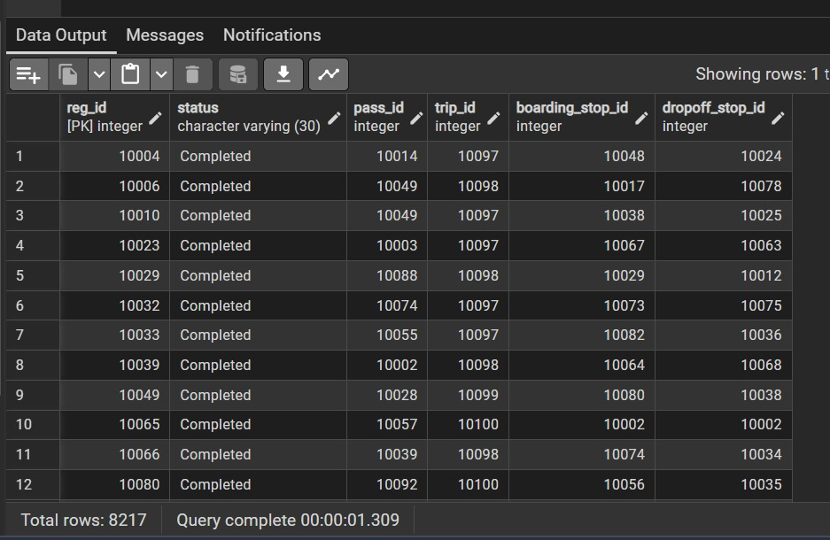
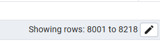
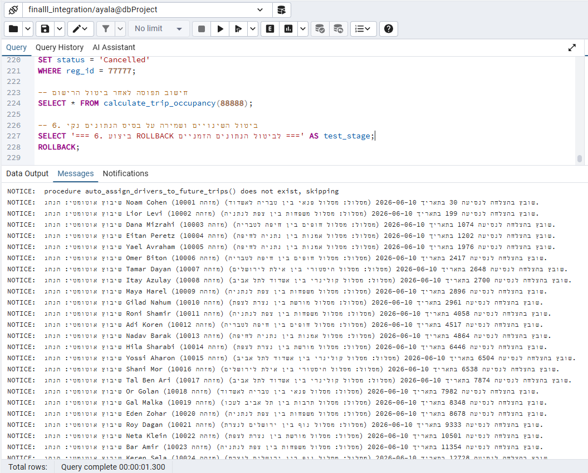

# דוח פרויקט - שלב ד' (פונקציות, פרוצדורות וטריגרים)
## מערכת TransRoute Planner

בשלב זה של הפרויקט הוספנו למערכת פונקציות, פרוצדורות וטריגרים מתקדמים בשפת **PL/pgSQL**, אשר מטפלים בלוגיקה העסקית של המערכת ישירות בתוך בסיס הנתונים (שכבת ה-Database). 

להלן פירוט של כל אחד מהרכיבים, הקוד המלא שלו, והוכחת הרצה מבוססת צילומי מסך מתוך הרצות הבדיקה ב-pgAdmin.

---

## 1. פונקציות (Functions)

### פונקציה 1: `get_route_dashboard`
* **תיאור מילולי:** 
  הפונקציה מייצרת ומחזירה `refcursor` המצביע לשאילתה מורכבת המאחדת את הטבלאות `route`, `region`, `route_stop` ו-`trip` (נסיעות עתידיות). היא מחשבת עבור כל מסלול את מספר התחנות שלו, האזור הגיאוגרפי, ונתוני הנסיעות העתידיות המתוזמנות.
* **שם הקובץ:** [function_get_route_dashboard.sql](file:///c:/DatabaseProject/DatabaseProject_4829_0087/phase4/function_get_route_dashboard.sql)
* **הקוד המלא:**
```sql
CREATE OR REPLACE FUNCTION get_route_dashboard()
RETURNS refcursor AS $$
DECLARE
    r_cursor refcursor := 'route_dashboard_cursor';
    route_exists BOOLEAN;
BEGIN
    SELECT EXISTS(SELECT 1 FROM route) INTO route_exists;
    IF NOT route_exists THEN
        RAISE NOTICE 'שים לב: לא נמצאו מסלולים בבסיס הנתונים.';
    END IF;

    OPEN r_cursor FOR
        SELECT 
            r.route_id, 
            r.route_name, 
            reg.regio_name AS region_name, 
            r.total_distance_km, 
            r.estimated_duration_minutes, 
            COALESCE(rs.stop_count, 0)::INT AS stop_count, 
            COALESCE(t.future_trip_count, 0)::INT AS future_trip_count
        FROM route r
        LEFT JOIN region reg ON r.region_id = reg.region_id
        LEFT JOIN (
            SELECT route_id, COUNT(stop_id) AS stop_count
            FROM route_stop
            GROUP BY route_id
        ) rs ON r.route_id = rs.route_id
        LEFT JOIN (
            SELECT route_id, COUNT(trip_id) AS future_trip_count
            FROM trip
            WHERE trip_date >= CURRENT_DATE
            GROUP BY route_id
        ) t ON r.route_id = t.route_id
        ORDER BY r.route_id;
        
    RETURN r_cursor;
EXCEPTION
    WHEN OTHERS THEN
        RAISE EXCEPTION 'שגיאה במהלך שליפת נתוני הדשבורד: %', SQLERRM;
END;
$$ LANGUAGE plpgsql;
```
* **הוכחת פעולה:**
  בזמן יצירת הפונקציה והרצת השאילתה הראשונית:
  
  בטאב ה-Data Output של pgAdmin מתקבלת טבלת נתוני הדשבורד הכוללת את כל המסלולים עם כמות התחנות והנסיעות המתוזמנות שלהם:
  

---

### פונקציה 2: `calculate_trip_occupancy`
* **תיאור מילולי:**
  מקבלת מזהה נסיעה ומחזירה טבלה עם קיבולת הרכב, מקומות פנויים, נוסעים רשומים (שאינם מבוטלים), אחוז תפוסה וסטטוס מילולי: `FULL` / `ALMOST FULL` / `AVAILABLE`. במידה והנסיעה לא קיימת, נזרק Exception.
* **שם הקובץ:** [function_calculate_trip_occupancy.sql](file:///c:/DatabaseProject/DatabaseProject_4829_0087/phase4/function_calculate_trip_occupancy.sql)
* **הקוד המלא:**
```sql
CREATE OR REPLACE FUNCTION calculate_trip_occupancy(p_trip_id INT)
RETURNS TABLE(
    trip_id INT,
    capacity INT,
    available_seats INT,
    registered_passengers INT,
    occupancy_percent NUMERIC,
    status_text VARCHAR
) AS $$
DECLARE
    v_capacity INT;
    v_available_seats INT;
    v_registered_count INT;
    v_occupancy_pct NUMERIC;
    v_status VARCHAR(20);
    v_trip_exists BOOLEAN;
BEGIN
    SELECT EXISTS(SELECT 1 FROM trip WHERE trip.trip_id = p_trip_id) INTO v_trip_exists;
    IF NOT v_trip_exists THEN
        RAISE EXCEPTION 'שגיאה: נסיעה עם מזהה % אינה קיימת במערכת.', p_trip_id;
    END IF;

    SELECT v.capacity, t.available_seats
    INTO v_capacity, v_available_seats
    FROM trip t
    JOIN vehicle v ON t.plate_number = v.plate_number
    WHERE t.trip_id = p_trip_id;

    SELECT COUNT(*)::INT
    INTO v_registered_count
    FROM registration r
    WHERE r.trip_id = p_trip_id
      AND (r.status IS NULL OR r.status <> 'Cancelled');

    IF v_capacity > 0 THEN
        v_occupancy_pct := ROUND((v_registered_count::NUMERIC / v_capacity::NUMERIC) * 100, 2);
    ELSE
        v_occupancy_pct := 0.00;
    END IF;

    IF v_occupancy_pct >= 100.00 OR v_available_seats = 0 THEN
        v_status := 'FULL';
    ELSIF v_occupancy_pct >= 80.00 THEN
        v_status := 'ALMOST FULL';
    ELSE
        v_status := 'AVAILABLE';
    END IF;

    RETURN QUERY
    SELECT p_trip_id, v_capacity, v_available_seats, v_registered_count, v_occupancy_pct, v_status;
END;
$$ LANGUAGE plpgsql;
```
* **הוכחת פעולה:**
  הרצה וקבלת נתוני תפוסה עבור נסיעות:
  
  הצגת נתוני תפוסה לדוגמה הכוללים את אחוז התפוסה והסטטוס המילולי:
  

---

## 2. פרוצדורות (Procedures)

### פרוצדורה 1: `schedule_new_trip`
* **תיאור מילולי:**
  מדמה את מסך Schedule New Trip. היא מקבלת את פרטי הנסיעה והנוסעים הצפויים, בודקת את קיומם של המסלול, הרכב והנהג בבסיס הנתונים באמצעות רשומות (`RECORD`), מוודאת שהקיבולת מתאימה, ומכניסה נסיעה חדשה עם מושבים פנויים מחושבים מראש.
* **שם הקובץ:** [procedure_schedule_new_trip.sql](file:///c:/DatabaseProject/DatabaseProject_4829_0087/phase4/procedure_schedule_new_trip.sql)
* **הקוד המלא:**
```sql
CREATE OR REPLACE PROCEDURE schedule_new_trip(
    p_trip_id INT,
    p_route_id INT,
    p_trip_date DATE,
    p_departure_time VARCHAR,
    p_expected_passengers INT,
    p_plate_number VARCHAR,
    p_driver_id INT
) AS $$
DECLARE
    r_route RECORD;
    r_vehicle RECORD;
    r_driver RECORD;
    v_available_seats INT;
BEGIN
    SELECT * INTO r_route FROM route WHERE route_id = p_route_id;
    IF NOT FOUND THEN
        RAISE EXCEPTION 'שגיאה: המסלול עם מזהה % אינו קיים במערכת.', p_route_id;
    END IF;

    SELECT * INTO r_vehicle FROM vehicle WHERE plate_number = p_plate_number;
    IF NOT FOUND THEN
        RAISE EXCEPTION 'שגיאה: הרכב עם מספר רישוי % אינו קיים במערכת.', p_plate_number;
    END IF;

    SELECT * INTO r_driver FROM driver WHERE driver_id = p_driver_id;
    IF NOT FOUND THEN
        RAISE EXCEPTION 'שגיאה: הנהג עם מזהה % אינו קיים במערכת.', p_driver_id;
    END IF;

    IF p_expected_passengers > r_vehicle.capacity THEN
        RAISE EXCEPTION 'שגיאה: מספר הנוסעים הצפוי (%) גדול מקיבולת הרכב (%).', 
            p_expected_passengers, r_vehicle.capacity;
    END IF;

    IF p_expected_passengers < 0 THEN
        RAISE EXCEPTION 'שגיאה: מספר הנוסעים הצפוי אינו יכול להיות שלילי.';
    END IF;

    v_available_seats := r_vehicle.capacity - p_expected_passengers;

    INSERT INTO trip (trip_id, trip_date, departure_time, available_seats, route_id, plate_number, driver_id)
    VALUES (p_trip_id, p_trip_date, p_departure_time, v_available_seats, p_route_id, p_plate_number, p_driver_id);

    RAISE NOTICE 'הנסיעה % נוספה בהצלחה! מסלול: %, רכב: %, נהג: %, מקומות פנויים התחלתיים: %.', 
        p_trip_id, r_route.route_name, p_plate_number, r_driver.driver_fullname, v_available_seats;

EXCEPTION
    WHEN UNIQUE_VIOLATION THEN
        RAISE EXCEPTION 'שגיאה: קיים כבר מפתח נסיעה כפול (%) במערכת.', p_trip_id;
    WHEN OTHERS THEN
        RAISE EXCEPTION 'שגיאה במהלך זימון הנסיעה החדשה: %', SQLERRM;
END;
$$ LANGUAGE plpgsql;
```
* **הוכחת פעולה:**
  בדיקת יצירת הפרוצדורה בהצלחה והודעות Notice על קבלת הנתונים:
  
  הוכחת הכנסת הנסיעה החדשה לטבלת הנסיעות:
  

---

### פרוצדורה 2: `auto_assign_drivers_to_future_trips`
* **תיאור מילולי:**
  משבצת נהגים באופן אוטומטי לנסיעות עתידיות ללא נהג משויך. היא משתמשת בכורסור מפורש למעבר על כל נסיעה עתידית פתוחה, ומשבצת נהגים במעגל (Round-Robin) על בסיס מזהי נהגים הטעונים לתוך מערך.
* **שם הקובץ:** [procedure_auto_assign_drivers.sql](file:///c:/DatabaseProject/DatabaseProject_4829_0087/phase4/procedure_auto_assign_drivers.sql)
* **הקוד המלא:**
```sql
CREATE OR REPLACE PROCEDURE auto_assign_drivers_to_future_trips()
AS $$
DECLARE
    cur_trips CURSOR FOR 
        SELECT trip_id, trip_date, route_id 
        FROM trip 
        WHERE trip_date >= CURRENT_DATE AND driver_id IS NULL
        ORDER BY trip_date, trip_id;
        
    r_trip RECORD;
    v_driver_ids INT[];
    v_driver_count INT;
    v_index INT := 1;
    v_assigned_driver_id INT;
    v_driver_name VARCHAR(100);
    v_route_name VARCHAR(100);
BEGIN
    SELECT ARRAY(SELECT driver_id FROM driver ORDER BY driver_id) INTO v_driver_ids;
    v_driver_count := ARRAY_LENGTH(v_driver_ids, 1);
    
    IF v_driver_count IS NULL OR v_driver_count = 0 THEN
        RAISE EXCEPTION 'שגיאה: לא נמצאו נהגים במערכת לצורך שיבוץ אוטומטי.';
    END IF;

    OPEN cur_trips;
    LOOP
        FETCH cur_trips INTO r_trip;
        EXIT WHEN NOT FOUND;
        
        v_assigned_driver_id := v_driver_ids[v_index];
        
        SELECT driver_fullname INTO v_driver_name FROM driver WHERE driver_id = v_assigned_driver_id;
        SELECT route_name INTO v_route_name FROM route WHERE route_id = r_trip.route_id;
        
        UPDATE trip 
        SET driver_id = v_assigned_driver_id 
        WHERE trip_id = r_trip.trip_id;
        
        RAISE NOTICE 'שיבוץ אוטומטי: הנהג % (מזהה %) שובץ בהצלחה לנסיעה % בתאריך % (מסלול: %).', 
            v_driver_name, v_assigned_driver_id, r_trip.trip_id, r_trip.trip_date, v_route_name;
            
        v_index := v_index + 1;
        IF v_index > v_driver_count THEN
            v_index := 1;
        END IF;
    END LOOP;
    CLOSE cur_trips;
EXCEPTION
    WHEN OTHERS THEN
        RAISE EXCEPTION 'שגיאה במהלך שיבוץ הנהגים האוטומטי: %', SQLERRM;
END;
$$ LANGUAGE plpgsql;
```
* **הוכחת פעולה:**
  בדיקת הרצת הפרוצדורה שמוצאת נסיעה ללא נהג ומשבצת אותה:
  
  הצגת רשומת הנסיעה המעודכנת לאחר ששויך לה נהג:
  
  הצגת השיבוץ המוצלח עם פרטי הנהג שנוספו:
  

---

## 3. טריגרים (Triggers)

### טריגר 1: `registration_after_insert_trigger`
* **תיאור מילולי:**
  מופעל לאחר הכנסת רישום (הזמנה) חדש לטבלת `registration`. אם הסטטוס אינו מבוטל, הוא נועל את רשומת הנסיעה ומפחית את כמות המושבים הפנויים ב-1. אם אין מקומות פנויים, הוא זורק חריגה וחוסם את ההרשמה.
* **שם הקובץ:** [trigger_registration_after_insert.sql](file:///c:/DatabaseProject/DatabaseProject_4829_0087/phase4/trigger_registration_after_insert.sql)
* **הקוד המלא:**
```sql
CREATE OR REPLACE FUNCTION trg_registration_after_insert()
RETURNS TRIGGER AS $$
DECLARE
    v_seats INT;
BEGIN
    IF NEW.status IS DISTINCT FROM 'Cancelled' THEN
        SELECT available_seats INTO v_seats
        FROM trip
        WHERE trip_id = NEW.trip_id
        FOR UPDATE;
        
        IF v_seats IS NULL THEN
            RAISE EXCEPTION 'שגיאה: נסיעה מספר % אינה קיימת במערכת.', NEW.trip_id;
        ELSIF v_seats <= 0 THEN
            RAISE EXCEPTION 'שגיאה: לא ניתן להירשם לנסיעה %: אין מקומות פנויים (Available Seats = 0)!', NEW.trip_id;
        END IF;

        UPDATE trip
        SET available_seats = available_seats - 1
        WHERE trip_id = NEW.trip_id;
        
        RAISE NOTICE 'ההרשמה % התקבלה בהצלחה. עודכן מושב פנוי בנסיעה % (נותרו % מקומות פנויים).', 
            NEW.reg_id, NEW.trip_id, v_seats - 1;
    END IF;
    RETURN NEW;
END;
$$ LANGUAGE plpgsql;

CREATE TRIGGER registration_after_insert_trigger
AFTER INSERT ON registration
FOR EACH ROW
EXECUTE FUNCTION trg_registration_after_insert();
```
* **הוכחת פעולה:**
  מספר המקומות הפנויים בנסיעה 11 לפני ההרשמה עמד על **27**:
  
  לאחר הרשמת נוסע (מזהה 99901), מספר המקומות ירד ל-**26**:
  
  פלט ההודעה על קבלת ההרשמה:
  
  טבלאות המעקב המראות שהרשומה נוספה ומקומות פנויים התעדכנו:
  
  
  **בדיקת מניעת שגיאת מפתח כפול (מפתח קיים) וזריקת Exception מתאים:**
  
  הרצת הטריגר המוצלחת לאחר ניקוי מקדים של מזהה הבדיקה:
  
  הצגת תוצאות עדכון מושבים פנויים בעקבות הטריגר ב-pgAdmin:
  

---

### טריגר 2: `registration_status_update_trigger`
* **תיאור מילולי:**
  טריגר המופעל בעת עדכון סטטוס הרשמה:
  - מעבר מ-Cancelled לסטטוס פעיל -> מוריד מקום פנוי (או זורק שגיאה אם הנסיעה מלאה).
  - מעבר מסטטוס פעיל ל-Cancelled -> מחזיר מקום פנוי לנסיעה.
* **שם הקובץ:** [trigger_registration_status_update.sql](file:///c:/DatabaseProject/DatabaseProject_4829_0087/phase4/trigger_registration_status_update.sql)
* **הקוד המלא:**
```sql
CREATE OR REPLACE FUNCTION trg_registration_status_update()
RETURNS TRIGGER AS $$
DECLARE
    v_seats INT;
    v_capacity INT;
BEGIN
    IF OLD.status IS DISTINCT FROM NEW.status THEN
        -- 1. שינוי סטטוס מ-Cancelled לסטטוס פעיל
        IF (OLD.status = 'Cancelled' OR OLD.status IS NULL) AND NEW.status <> 'Cancelled' THEN
            SELECT available_seats INTO v_seats
            FROM trip
            WHERE trip_id = NEW.trip_id
            FOR UPDATE;
            
            IF v_seats <= 0 THEN
                RAISE EXCEPTION 'שגיאה: לא ניתן להפעיל מחדש את הרישום מספר %: אין מקומות פנויים בנסיעה %!', NEW.reg_id, NEW.trip_id;
            END IF;
            
            UPDATE trip
            SET available_seats = available_seats - 1
            WHERE trip_id = NEW.trip_id;
            
            RAISE NOTICE 'עדכון הרשמה: סטטוס ההרשמה % שונה לפעיל. ירד מושב בנסיעה % (נותרו % מקומות פנויים).',
                NEW.reg_id, NEW.trip_id, v_seats - 1;
                
        -- 2. שינוי סטטוס מסטטוס פעיל ל-Cancelled
        ELSIF (OLD.status <> 'Cancelled' OR OLD.status IS NULL) AND NEW.status = 'Cancelled' THEN
            SELECT t.available_seats, v.capacity 
            INTO v_seats, v_capacity
            FROM trip t
            JOIN vehicle v ON t.plate_number = v.plate_number
            WHERE t.trip_id = NEW.trip_id
            FOR UPDATE;
            
            IF v_seats < v_capacity THEN
                UPDATE trip
                SET available_seats = available_seats + 1
                WHERE trip_id = NEW.trip_id;
                
                RAISE NOTICE 'עדכון הרשמה: ההרשמה % בוטלה. הוחזר מושב לנסיעה % (יש כעת % מקומות פנויים מתוך קיבולת של %).',
                    NEW.reg_id, NEW.trip_id, v_seats + 1, v_capacity;
            ELSE
                RAISE NOTICE 'הערה: מספר המושבים הפנויים בנסיעה % כבר שווה לקיבולת המקסימלית (%). לא בוצע עדכון נוסף.',
                    NEW.trip_id, v_capacity;
            END IF;
        END IF;
    END IF;
    RETURN NEW;
END;
$$ LANGUAGE plpgsql;

CREATE TRIGGER registration_status_update_trigger
AFTER UPDATE ON registration
FOR EACH ROW
EXECUTE FUNCTION trg_registration_status_update();
```
* **הוכחת פעולה:**
  הצגת כמות המקומות לפני שינוי הסטטוס:
  
  הצגת כמות המקומות שהופחתה בעקבות שינוי סטטוס מביטול להפעלה:
  
  הצגת החזרת המושב הפנוי לאחר שינוי הסטטוס בחזרה ל-Cancelled:
  

---

## 4. תוכניות ראשיות ובדיקות אינטגרציה (Main Programs)

### תוכנית ראשית 1: `main_schedule_and_dashboard`
* **תיאור מילולי:**
  התוכנית מדגימה שילוב של זימון נסיעה חדשה עם הצגת דשבורד מסלולים לפני ואחרי הזימון. היא מריצה את הכל בטרנזקציה אחת מבוקרת ומבצעת בסופה ROLLBACK.
* **שם הקובץ:** [main_schedule_and_dashboard.sql](file:///c:/DatabaseProject/DatabaseProject_4829_0087/phase4/main_schedule_and_dashboard.sql)
* **הקוד המלא:**
*(הקוד המלא הכולל את ההגדרות בראשו מופיע בקובץ `main_schedule_and_dashboard.sql`)*
* **הוכחת פעולה:**
  בזמן הרצה ראשונה עם כפל כורסורים, התקבלה שגיאה מתוכננת על כך שהכורסור כבר בשימוש:
  
  הצגת התיקון שהתווסף (הוספת CLOSE):
  
  תוצאות ההרצה המוצלחת שמציגה את הודעת הוספת הנסיעה וסגירת הכורסור:
  

---

### תוכנית ראשית 2: `main_driver_and_occupancy`
* **תיאור מילולי:**
  מכניסה נסיעה עתידית זמנית ללא נהג, מריצה את שיבוץ הנהגים, מחשבת תפוסה, מבצעת הרשמה פעילה (מורידה מקום פנוי), ולבסוף מבצעת ביטול הרשמה (מחזירה מקום פנוי).
* **שם הקובץ:** [main_driver_and_occupancy.sql](file:///c:/DatabaseProject/DatabaseProject_4829_0087/phase4/main_driver_and_occupancy.sql)
* **הקוד המלא:**
*(הקוד המלא הכולל את ההגדרות בראשו מופיע בקובץ `main_driver_and_occupancy.sql`)*
* **הוכחת פעולה:**
  הרצת התוכנית הראשית השניה ב-pgAdmin:
  
  הפלט של הודעות ה-NOTICE המפורטות בטאב ה-Messages המראה את שיבוץ הנהגים בסבב (Round-Robin) לכל הנסיעות העתידיות:
  
  הפלט שמציג את אחוזי התפוסה המשתנים והקצאת הנהגים:
  
